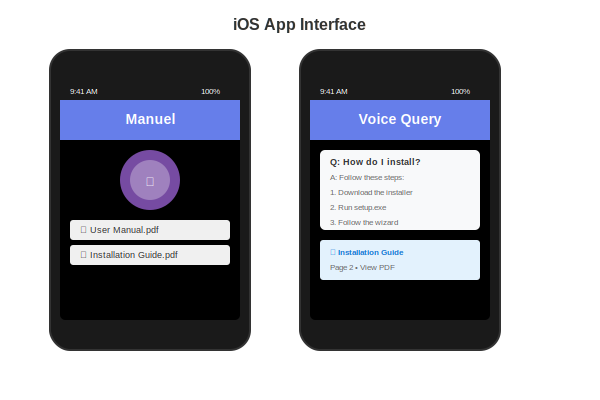
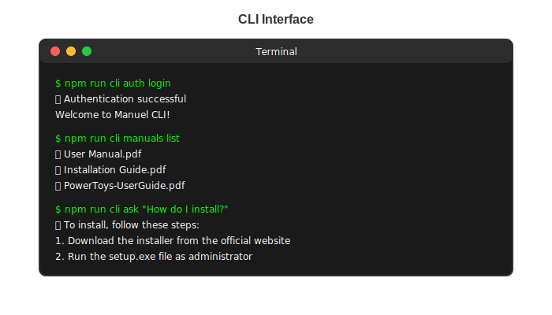
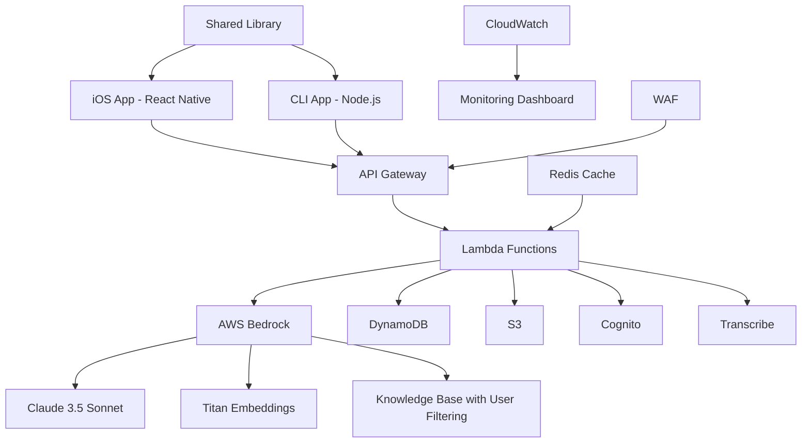

<div align="center">
  
</div>

# Manuel - AI Powered Studio Assistant 

> Meet Manuel, your AI-powered voice assistant managing all product manuals using AWS
> Bedrock

[](https://opensource.org/licenses/MIT)
[](https://conventionalcommits.org)
[](https://aws.amazon.com/bedrock/)
[](https://reactnative.dev/)

---

**Manuel is your friendly AI assistant who specializes in helping you find
answers in your product manuals.** Whether you're setting up a new device,
troubleshooting an issue, or learning advanced features, Manuel is here to help
with both text and voice queries. Just like a helpful concierge, Manuel knows
your manuals inside and out!

## 🚀 Quick Start

<div align="center">
  
  
</div>

### Prerequisites

- AWS CLI configured with appropriate permissions
- Node.js 18+ for frontend and build tools
- Python 3.11+ for backend development
- SAM CLI for serverless deployment

### Backend Deployment

```bash
cd backend
sam build
sam deploy --template template-minimal.yaml --resolve-s3
```

### Frontend Setup

#### iOS App

```bash
cd frontend/packages/ios-app
npm install
expo start
```

#### CLI App

```bash
cd frontend
npm install
npm run cli -- --help
# Quick commands:
npm run cli auth login
npm run cli manuals list
npm run cli ask "your question"
npm run cli query voice
```

## 📚 Documentation

- [Backend Documentation](backend/README.md) - AWS serverless backend
- [Frontend Documentation](frontend/README.md) - Dual-platform frontend
  architecture
- [iOS App Documentation](frontend/packages/ios-app/README.md) - React Native
  iOS app
- [CLI App Documentation](frontend/packages/cli-app/README.md) - Command-line
  interface
- [Shared Library Documentation](frontend/packages/shared/README.md) - Common
  business logic
- [Contributing Guidelines](CONTRIBUTING.md) - Development workflow
- [Remote Setup Guide](REMOTE_SETUP.md) - Repository setup
- [Security Policy](SECURITY.md) - Security guidelines

## 🏗️ Architecture

### High-Level Overview



### Technology Stack

- **Backend**: AWS Serverless (Lambda, API Gateway, DynamoDB, S3)
- **AI/ML**: AWS Bedrock (Claude 3.5 Sonnet, Titan Embeddings)
- **Frontend**: Dual-platform architecture
  - **iOS**: React Native with Expo
  - **CLI**: Node.js with Commander.js and Inquirer
  - **Shared**: TypeScript library with platform adapters
- **Authentication**: AWS Cognito with JWT tokens
- **Monitoring**: CloudWatch with custom dashboards
- **Security**: Multi-layer security with WAF and middleware
- **Performance**: Redis caching and connection pooling
- **Testing**: Comprehensive integration testing with chaos engineering

## 🔒 Security Features

- **Enhanced API Security**: Rate limiting (50 req/15min) with automatic retry
  logic
- **Multi-Layer Security**: WAF protection + application middleware
- **User Data Isolation**: Complete separation of user data using metadata
  filtering
- **Input Validation**: Advanced XSS and SQL injection prevention with
  sanitization
- **VPC Security**: Private subnet isolation with secure VPC endpoints
- **Authentication**: JWT-based authentication with refresh tokens
- **Encryption**: Data encryption at rest and in transit
- **Security Headers**: Comprehensive security headers (HSTS, CSP,
  X-Frame-Options)
- **IP Allowlisting**: Configurable IP address restrictions
- **Redis Caching**: Secure Redis caching with user isolation
- **Smart Error Handling**: User-friendly security error messages and recovery
  tips
- **Security Testing**: Automated security scanning and penetration testing

## 🧪 Testing & Quality

- **Integration Testing**: Comprehensive test suite with 7 test categories
- **Chaos Engineering**: Failure scenario simulation and resilience testing
- **Security Testing**: Vulnerability scanning and penetration testing
- **Performance Testing**: Load testing and performance benchmarking
- **Code Quality**: Pre-commit hooks with linting and formatting
- **CI/CD Pipeline**: Automated testing and deployment
- **Coverage**: Minimum 80% test coverage requirement

## 📈 Monitoring & Observability

- **Real-time Dashboards**: CloudWatch dashboards with custom metrics
- **Structured Logging**: JSON-formatted logs with correlation IDs
- **Custom Metrics**: Business KPIs and performance indicators
- **Alerting**: SNS notifications for critical events
- **Cost Tracking**: Real-time cost calculation and optimization
- **Error Tracking**: Advanced error handling with retry strategies
- **Performance Monitoring**: Response time and throughput tracking

## 🚀 Deployment Environments

### Development

- Basic resource allocation
- Permissive CORS settings
- No email alerts
- Local testing support

### Production

- Enhanced performance configuration
- Restricted CORS to specific domains
- Email alerts enabled
- X-Ray tracing enabled
- Extended log retention

### Claude 4 Testing

- Conservative quotas for cost control
- Enhanced monitoring and alerting
- Cross-region inference profiles
- Comprehensive performance tracking

## 🤝 Contributing

We welcome contributions! Please read our
[Contributing Guidelines](CONTRIBUTING.md) for details on:

- Code of conduct
- Development setup
- Commit message standards (Conventional Commits)
- Pull request process
- Code review guidelines

### Quick Contribution Setup

```bash
# Clone the repository
git clone https://github.com/a1o1/manuel.git
cd manuel

# Install commitizen for conventional commits
pipx install commitizen

# Backend setup
cd backend
pip install -r requirements.txt
pip install -r tests/integration/fixtures/requirements.txt

# Install pre-commit hooks
pre-commit install
```

## 📄 License

This project is licensed under the MIT License - see the [LICENSE](LICENSE) file
for details.

## 🔗 Links

- [AWS Bedrock Documentation](https://docs.aws.amazon.com/bedrock/)
- [AWS SAM Documentation](https://docs.aws.amazon.com/serverless-application-model/)
- [Conventional Commits](https://conventionalcommits.org/)
- [React Native Documentation](https://reactnative.dev/)

## 💬 Support

- **Documentation**: Check the comprehensive documentation in each module
- **Issues**: Report bugs and request features via GitHub Issues
- **Discussions**: Use GitHub Discussions for questions and community support
- **Security**: Report security vulnerabilities privately via
  security@manuel.com

## 🎯 Roadmap

### Phase 1: Foundation (Completed)

- ✅ Enterprise-grade backend architecture
- ✅ Multi-layer security implementation
- ✅ Comprehensive testing framework
- ✅ Monitoring and observability
- ✅ CI/CD pipeline setup

### Phase 2: Frontend & Mobile (Completed)

- ✅ Dual-platform frontend architecture
- ✅ React Native iOS application
- ✅ Node.js CLI application
- ✅ Shared business logic library
- ✅ Platform adapter pattern
- ✅ Voice recording and playback
- ✅ Authentication integration
- ✅ Interactive terminal interface
- ✅ User data isolation and testing framework
- ✅ Environment switching for development
- ✅ End-to-end voice query functionality
- ✅ File deduplication system
- ✅ URL-based manual upload
- ✅ Enhanced CLI security features (v1.0.2)
- ✅ Redis caching for performance optimization
- ✅ Advanced API security hardening

### Phase 3: Advanced Features (Planned)

- 📋 Multi-language support
- 📋 Advanced analytics dashboard
- 📋 Custom model fine-tuning
- 📋 Enterprise SSO integration

### Phase 4: Scale & Optimization (Planned)

- 📋 Multi-region deployment
- 📋 Advanced caching strategies
- 📋 Performance optimization
- 📋 Cost optimization features

---

<div align="center">
  <strong>Built with ❤️ by the Manuel Team</strong>
</div>
