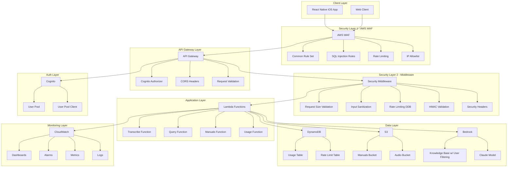
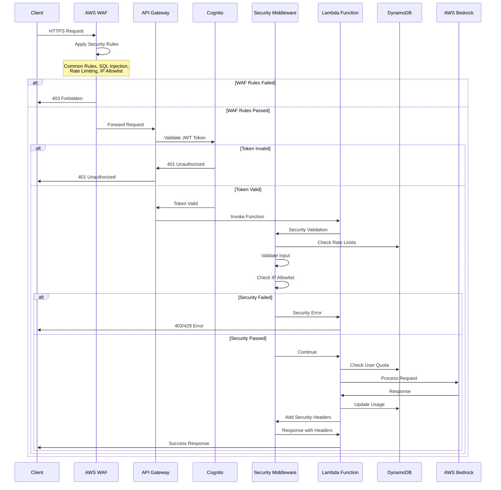
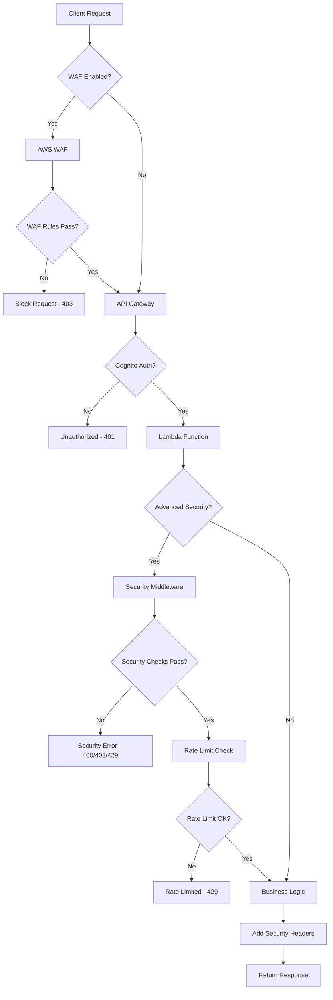
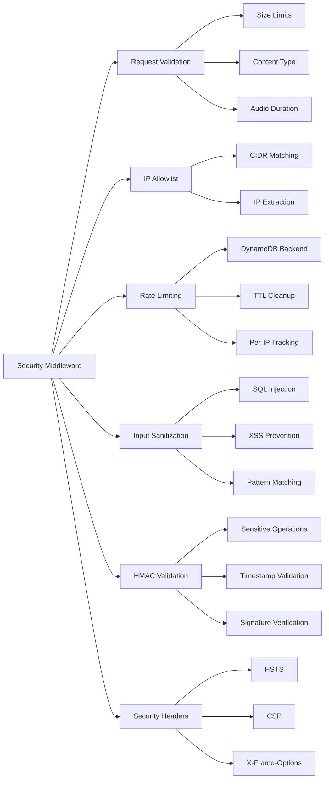
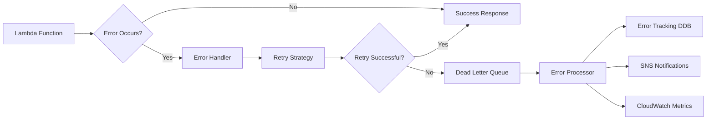
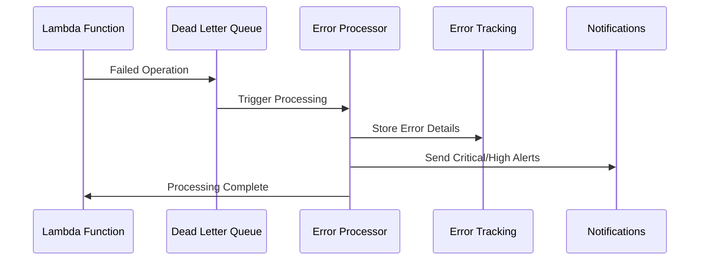
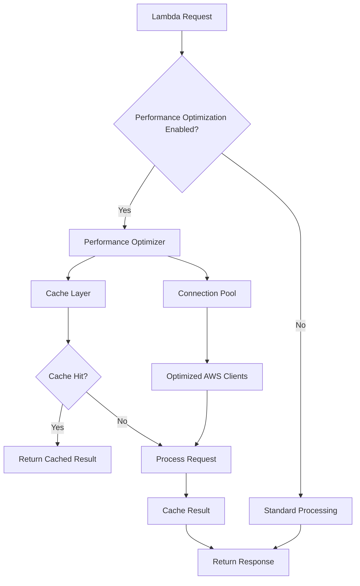
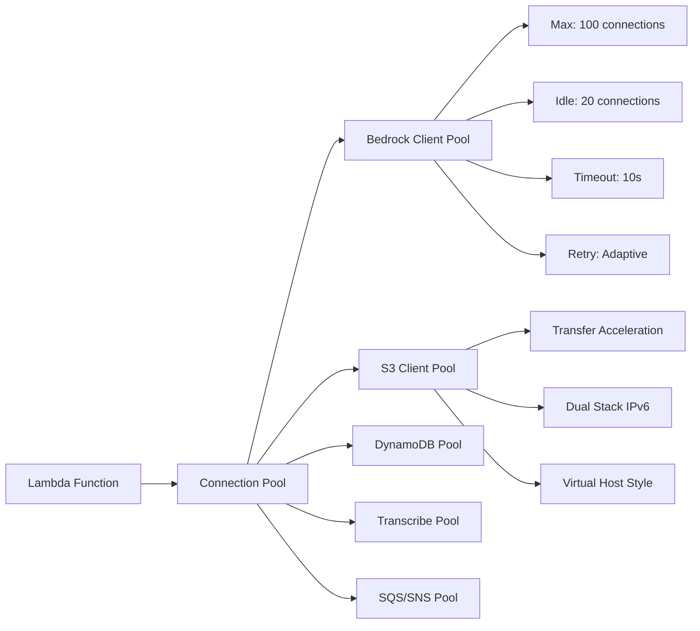
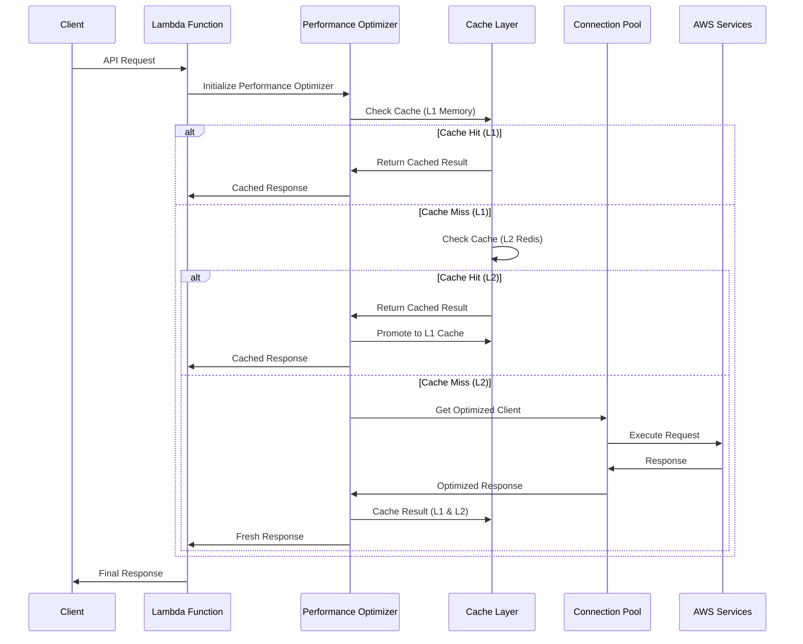
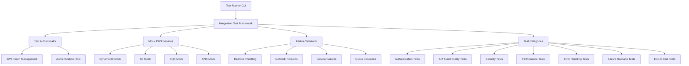

# Manuel Backend - AWS Serverless Application

## Overview

This is the backend for Manuel, a voice-powered assistant for querying product
manuals using AWS Bedrock and RAG (Retrieval Augmented Generation). The system
implements complete user data isolation, ensuring each user can only access
documents they have uploaded.

## Architecture

### High-Level Architecture

- **Region**: eu-west-1 (Dublin, Ireland)
- **Framework**: AWS SAM (Serverless Application Model)
- **Runtime**: Python 3.11
- **Authentication**: AWS Cognito
- **Storage**: S3 (manuals), DynamoDB (usage tracking)
- **AI/ML**: AWS Bedrock (Claude 3.5 Sonnet + Titan Embeddings)
- **User Isolation**: Metadata filtering with Bedrock Knowledge Base
- **Security**: Multi-layered enterprise-grade security framework
- **Monitoring**: CloudWatch Dashboard, Alarms, Custom Metrics

### System Architecture with Security Layers



### Security-First Request Flow



## Quick Start

### Prerequisites

- AWS CLI configured with appropriate permissions
- SAM CLI installed
- Python 3.11+

### Deployment

```bash
# Development environment
sam build
sam deploy --parameter-overrides-file parameters.json --guided

# Production environment
sam deploy --parameter-overrides-file parameters-production.json

# Claude 4 testing (when available)
sam deploy --parameter-overrides-file parameters-claude4.json
```

## Configuration

### Parameter Files

The application uses parameter files for environment-specific configuration:

#### Development (`parameters.json`)

- Basic resource allocation (256MB Lambda memory)
- No email alerts
- Permissive CORS settings
- 14-day log retention

#### Production (`parameters-production.json`)

- Enhanced performance (512MB Lambda memory)
- Email alerts enabled
- Restricted CORS to specific domain
- 90-day log retention
- X-Ray tracing enabled

#### Claude 4 Testing (`parameters-claude4.json`)

- Conservative quotas (30 daily, 500 monthly)
- Enhanced monitoring
- Claude 4 Sonnet model with inference profiles
- X-Ray tracing enabled

### Key Parameters

| Parameter           | Description                   | Dev Default       | Prod Default      |
| ------------------- | ----------------------------- | ----------------- | ----------------- |
| `TextModelId`       | Bedrock text generation model | Claude 3.5 Sonnet | Claude 3.5 Sonnet |
| `EmbeddingModelId`  | Bedrock embedding model       | Titan Text v2     | Titan Text v2     |
| `DailyQuotaLimit`   | Max queries per user per day  | 50                | 100               |
| `LambdaMemorySize`  | Lambda memory allocation (MB) | 256               | 512               |
| `EnableXRayTracing` | AWS X-Ray distributed tracing | false             | true              |
| `AlertEmail`        | Email for alerts              | ""                | admin@domain.com  |

## API Endpoints

### Authentication

All endpoints require Cognito JWT authentication (except OPTIONS).

### Core Endpoints

- `POST /api/transcribe` - Convert audio to text (user-scoped)
- `POST /api/query` - RAG-powered Q&A (queries user's documents only)
- `GET /api/manuals` - List user's manuals only
- `POST /api/manuals/upload` - Upload new manuals (associated with user)
- `GET /api/user/usage` - Get user usage statistics
- `GET /api/user/quota` - Get quota limits

### Request/Response Examples

#### Transcribe Audio

```json
POST /api/transcribe
{
  "audio_data": "base64_encoded_audio",
  "content_type": "audio/mp4"
}

Response:
{
  "transcription": "How do I configure the wireless settings?",
  "usage": {
    "daily_used": 5,
    "daily_limit": 50,
    "monthly_used": 25,
    "monthly_limit": 1000
  }
}
```

#### Query with RAG

```json
POST /api/query
{
  "question": "How do I configure the wireless settings?"
}

Response:
{
  "answer": "To configure wireless settings, follow these steps...",
  "context_used": 3,
  "usage": { ... }
}
```

## User Data Isolation

### Overview

Manuel implements complete user data isolation using AWS Bedrock Knowledge Base
metadata filtering. Each user can only access documents they have uploaded,
providing secure multi-tenant functionality.

### Implementation Details

- **Metadata JSON Files**: Generated automatically for each uploaded document
- **User ID Filtering**: Knowledge Base queries filtered by authenticated user
- **Backward Compatibility**: Existing documents without metadata continue to
  work
- **S3 Structure**: Metadata files co-located with documents (`.metadata.json`
  suffix)

### Metadata Structure

```json
{
  "metadataAttributes": {
    "user_id": "auth0|user123456",
    "uploaded_by": "auth0|user123456",
    "original_filename": "user_manual.pdf",
    "upload_timestamp": "2025-01-12T10:30:00.000Z",
    "upload_method": "direct_upload",
    "file_type": "application/pdf",
    "source_url": "https://example.com/manual.pdf"
  }
}
```

### Query Filtering

All Knowledge Base retrieval operations automatically filter by the
authenticated user's ID:

```python
retrieval_config = {
    "vectorSearchConfiguration": {
        "numberOfResults": max_results,
        "overrideSearchType": "HYBRID",
        "filter": {
            "equals": {
                "key": "user_id",
                "value": user_id
            }
        }
    }
}
```

For detailed implementation information, see
[METADATA_FILTERING_IMPLEMENTATION.md](METADATA_FILTERING_IMPLEMENTATION.md).

## Monitoring & Observability

### CloudWatch Dashboard

Access via CloudFormation output `DashboardURL` or:

```
https://eu-west-1.console.aws.amazon.com/cloudwatch/home?region=eu-west-1#dashboards:name=Manuel-{stage}
```

#### Dashboard Widgets

1. **API Gateway Metrics**: Request count, 4xx/5xx errors, latency
2. **Lambda Function Performance**: Invocations, errors, duration
3. **DynamoDB Usage**: Read/write capacity, throttling
4. **S3 Storage**: Bucket size, object count
5. **Error Analysis**: Recent error logs with filtering

### Custom Metrics

The application emits custom CloudWatch metrics under the `Manuel/Application`
namespace:

| Metric                 | Description             | Dimensions           |
| ---------------------- | ----------------------- | -------------------- |
| `RequestDuration`      | Request processing time | Function, StatusCode |
| `RequestCount`         | Number of requests      | Function, StatusCode |
| `QuotaUsagePercentage` | Quota usage percentage  | QuotaType, Operation |
| `BedrockCallDuration`  | Bedrock API call time   | Model, Operation     |
| `BedrockTokens`        | Tokens consumed         | Model, Operation     |
| `KnowledgeBaseResults` | KB search results count | -                    |

### Alerting

SNS topic configured for critical alerts:

- API Gateway 4xx/5xx errors (>10/5 per 5min)
- High API latency (>threshold)
- Lambda function errors (>5 per 5min)
- DynamoDB throttling
- Lambda function timeouts

### Structured Logging

All Lambda functions use structured JSON logging:

```json
{
  "timestamp": "2025-01-10T12:00:00Z",
  "level": "INFO",
  "function": "manuel-query",
  "request_id": "abc123",
  "message": "Request completed",
  "status_code": 200,
  "duration_ms": 1234,
  "user_id": "user123",
  "context_used": 3
}
```

## Security

### Enterprise-Grade Security Framework

Manuel implements a comprehensive multi-layered security approach with
enterprise-grade features:

#### Layer 1: AWS WAF (Web Application Firewall)

- **OWASP Top 10 Protection**: Automated protection against common attacks
- **SQL Injection Prevention**: Pattern-based detection and blocking
- **Known Bad Inputs**: AWS-managed rule sets for malicious content
- **Rate Limiting**: IP-based request throttling
- **IP Allowlisting**: Configurable CIDR range restrictions
- **Configuration**: Enable with `EnableWAF: "true"`

#### Layer 2: Advanced Security Middleware

- **Request Validation**: Size limits, content scanning, malicious pattern
  detection
- **Distributed Rate Limiting**: DynamoDB-backed per-IP rate limiting
- **Input Sanitization**: SQL injection and XSS prevention
- **HMAC Signature Validation**: For sensitive operations
- **Security Headers**: HSTS, CSP, X-Frame-Options, and more
- **Configuration**: Enable with `EnableAdvancedSecurity: "true"`

#### Layer 3: Authentication & Authorization

- **Cognito User Pool**: Email-based authentication with MFA support
- **JWT Tokens**: API Gateway authorizer with token validation
- **Token Validity**: Configurable (1-24 hours access, 1-365 days refresh)
- **Session Management**: Secure token refresh and revocation

#### Layer 4: Data Protection

- **S3 Encryption**: Server-side encryption (AES-256)
- **DynamoDB**: Encryption at rest with optional customer-managed keys
- **API Gateway**: HTTPS only with TLS 1.2+
- **CORS**: Configurable origins with strict production settings

#### Layer 5: Access Control

- **IAM Roles**: Least privilege for all services
- **Lambda Functions**: Isolated execution environments
- **S3 Buckets**: Public access blocked, bucket policies enforced
- **Network Security**: VPC-less architecture with service-to-service
  authentication

### Security Configuration

#### Development Environment

```json
{
  "EnableWAF": "false",
  "EnableAdvancedSecurity": "false",
  "MaxRequestSizeMB": "10",
  "RateLimitRequests": "100",
  "IPAllowlist": ""
}
```

#### Production Environment

```json
{
  "EnableWAF": "true",
  "EnableAdvancedSecurity": "true",
  "MaxRequestSizeMB": "5",
  "RateLimitRequests": "50",
  "IPAllowlist": "203.0.113.0/24,198.51.100.0/24"
}
```

### Security Request Flow



### Security Middleware Components



### Security Monitoring

#### CloudWatch Metrics

- **WAF Metrics**: Blocked requests, rule violations, rate limiting
- **Security Events**: Failed validations, rate limit violations, suspicious
  patterns
- **Performance Impact**: Security middleware latency and throughput

#### Security Alarms

- **High Security Event Rate**: Unusual number of security violations
- **WAF Rule Violations**: Potential attack patterns detected
- **Rate Limit Breaches**: Excessive requests from single IP
- **Failed Authentication**: Unusual authentication failure patterns

### Security Best Practices

#### IP Allowlisting

```bash
# Single IP
"IPAllowlist": "203.0.113.12"

# CIDR Range
"IPAllowlist": "203.0.113.0/24"

# Multiple IPs/Ranges
"IPAllowlist": "203.0.113.12,198.51.100.0/24,10.0.0.0/8"
```

#### HMAC Key Management

```bash
# Generate secure key
openssl rand -base64 32

# Store in AWS Secrets Manager (recommended)
aws secretsmanager create-secret \
  --name manuel-security-hmac-key \
  --secret-string '{"hmac_key": "your-generated-key"}'
```

#### Security Headers Added

- `Strict-Transport-Security`: Force HTTPS
- `X-Content-Type-Options`: Prevent MIME sniffing
- `X-Frame-Options`: Prevent clickjacking
- `X-XSS-Protection`: Browser XSS protection
- `Content-Security-Policy`: Prevent XSS attacks
- `Referrer-Policy`: Control referrer information

## Advanced Error Handling

### Enterprise-Grade Error Management

Manuel implements sophisticated error handling with multiple layers of fault
tolerance:

#### Error Handling Architecture



#### Retry Strategies

- **Exponential Backoff**: Bedrock, S3 operations with jitter
- **Linear Backoff**: Transcribe operations
- **Fixed Delay**: Simple operations
- **Jittered Backoff**: High-throughput operations

#### Service-Specific Retry Configurations

```json
{
  "bedrock": {
    "max_retries": 3,
    "base_delay": 2000,
    "max_delay": 30000,
    "strategy": "exponential_backoff",
    "jitter": true
  },
  "transcribe": {
    "max_retries": 2,
    "base_delay": 1000,
    "max_delay": 10000,
    "strategy": "linear_backoff"
  },
  "dynamodb": {
    "max_retries": 5,
    "base_delay": 500,
    "max_delay": 8000,
    "strategy": "exponential_backoff"
  }
}
```

#### Error Classification System

- **Critical**: Service unavailable, internal server errors
- **High**: Quota exceeded, timeout errors, 5xx responses
- **Medium**: Resource not found, 4xx client errors
- **Low**: Validation errors, expected business logic errors

#### Dead Letter Queue Processing



#### Error Tracking & Analysis

- **DynamoDB Storage**: Structured error data with TTL
- **Error Deduplication**: Hash-based duplicate detection
- **Severity Classification**: Automated error severity assignment
- **Correlation Tracking**: Request ID correlation across services

### Error Handling Configuration

#### Development Environment

```json
{
  "EnableAdvancedErrorHandling": "false",
  "ErrorRetentionDays": "30",
  "MaxRetryAttempts": "3",
  "BaseRetryDelay": "1000",
  "MaxRetryDelay": "30000"
}
```

#### Production Environment

```json
{
  "EnableAdvancedErrorHandling": "true",
  "ErrorRetentionDays": "90",
  "MaxRetryAttempts": "5",
  "BaseRetryDelay": "2000",
  "MaxRetryDelay": "60000"
}
```

### Error Handling Components

#### Advanced Error Handler

- **Service-Specific Retry Logic**: Customized retry strategies per AWS service
- **Intelligent Backoff**: Exponential, linear, and jittered retry patterns
- **Exception Classification**: Automatic retry decision based on error type
- **Context Preservation**: Detailed error context for debugging

#### Error Processor Function

- **SQS Integration**: Automated processing of failed operations
- **Error Enrichment**: Additional context and classification
- **Notification Routing**: Severity-based alert distribution
- **Metrics Generation**: Error rate and pattern analysis

#### Monitoring & Alerting

- **Real-time Alerts**: Critical and high-severity error notifications
- **Error Dashboards**: Visual error tracking and trends
- **Performance Impact**: Error handling latency monitoring
- **Success Rate Tracking**: Retry success rate metrics

### Error Handling Best Practices

#### Retry Strategy Selection

- **Transient Errors**: Use exponential backoff with jitter
- **Rate Limiting**: Implement longer delays with linear backoff
- **Circuit Breakers**: Combine with existing circuit breaker patterns
- **Timeout Handling**: Set appropriate timeout values per service

#### Error Context Enrichment

```python
error_context = ErrorContext(
    function_name="query",
    request_id=context.aws_request_id,
    user_id=user_id,
    operation="bedrock_invoke_model",
    error_details={"model_id": model_id, "question": question}
)
```

#### Custom Error Messages

- **User-Friendly**: Convert technical errors to user-friendly messages
- **Security**: Avoid exposing sensitive internal details
- **Actionable**: Provide guidance where possible
- **Consistent**: Maintain consistent error response format

## Performance Optimization

### Enterprise-Grade Performance System

Manuel implements comprehensive performance optimization with connection
pooling, caching, and resource management:

#### Performance Architecture



#### Multi-Layer Caching Strategy

- **L1 Cache**: In-memory LRU cache for fastest access
- **L2 Cache**: Redis distributed cache for shared state
- **Hybrid Cache**: Intelligent cache promotion/demotion
- **TTL Management**: Configurable time-to-live per data type

#### Cache Data Types & TTL

```json
{
  "bedrock_responses": {
    "ttl_seconds": 900,
    "max_size": 500,
    "description": "LLM responses (15 min)"
  },
  "knowledge_base_results": {
    "ttl_seconds": 1800,
    "max_size": 200,
    "description": "Knowledge base queries (30 min)"
  },
  "transcription_results": {
    "ttl_seconds": 3600,
    "max_size": 100,
    "description": "Audio transcriptions (1 hour)"
  },
  "user_usage": {
    "ttl_seconds": 300,
    "max_size": 1000,
    "description": "User quota data (5 min)"
  }
}
```

#### Connection Pooling Architecture



### Performance Optimization Features

#### Connection Pool Management

- **Adaptive Connection Pooling**: Dynamic pool sizing based on load
- **Service-Specific Optimization**: Tailored configurations per AWS service
- **Connection Reuse**: Persistent connections across Lambda invocations
- **Health Monitoring**: Connection health checks and automatic recovery

#### Intelligent Caching

- **Request Deduplication**: Identical requests served from cache
- **Cache Warming**: Proactive cache population for common queries
- **Cache Invalidation**: Smart cache eviction policies
- **Compression**: Gzip compression for cache storage efficiency

#### Performance Monitoring

- **Cache Hit Rates**: Real-time cache performance metrics
- **Connection Pool Metrics**: Pool utilization and performance tracking
- **Latency Optimization**: Response time improvements measurement
- **Memory Usage**: Cache memory consumption monitoring

### Performance Configuration

#### Development Environment

```json
{
  "EnablePerformanceOptimization": "false",
  "EnableRedisCache": "false",
  "MaxConnections": "50",
  "MaxIdleConnections": "10",
  "ConnectionTimeout": "10",
  "ReadTimeout": "30",
  "CacheMemorySize": "1000"
}
```

#### Production Environment

```json
{
  "EnablePerformanceOptimization": "true",
  "EnableRedisCache": "true",
  "RedisCacheNodeType": "cache.t3.small",
  "MaxConnections": "100",
  "MaxIdleConnections": "20",
  "ConnectionTimeout": "10",
  "ReadTimeout": "30",
  "CacheMemorySize": "2000"
}
```

### Performance Optimization Flow



### Performance Optimization Components

#### Memory Cache (L1)

- **LRU Eviction**: Least Recently Used cache eviction
- **Thread-Safe**: Multi-threaded access with locks
- **TTL Support**: Per-item time-to-live configuration
- **Size Limits**: Configurable maximum cache size

#### Redis Cache (L2)

- **Distributed**: Shared cache across Lambda instances
- **Compression**: Gzip compression for storage efficiency
- **Clustering**: High availability Redis cluster support
- **Persistence**: Optional data persistence with snapshots

#### Hybrid Cache Strategy

- **Cache Promotion**: Frequent L2 items promoted to L1
- **Cache Demotion**: Infrequent L1 items demoted to L2
- **Intelligent Routing**: Automatic cache layer selection
- **Conflict Resolution**: Cache consistency management

### Performance Optimization Best Practices

#### Cache Key Design

```python
# Create cache key from arguments
cache_key = optimizer._create_cache_key(
    "bedrock",
    model_id,
    prompt_hash
)
```

#### Connection Pool Optimization

```python
# Get optimized client
bedrock_client = optimizer.connection_pool.get_bedrock_client()

# Warm up connections
warmup_results = optimizer.warm_up_connections()
```

#### Cache Management

```python
# Cache with TTL
optimizer.cache_bedrock_response(
    model_id,
    prompt,
    response,
    ttl=900  # 15 minutes
)

# Cache invalidation
optimizer.invalidate_user_usage_cache(user_id)
```

### Performance Impact

#### Expected Performance Improvements

- **Cache Hit Rate**: 60-80% for repeated queries
- **Response Time**: 40-60% reduction for cached responses
- **Connection Overhead**: 30-50% reduction in connection setup time
- **Memory Efficiency**: 20-30% reduction in memory allocation

#### Monitoring Metrics

- **Cache Hit Ratio**: Percentage of requests served from cache
- **Connection Pool Utilization**: Active vs idle connections
- **Cache Memory Usage**: Memory consumption by cache layers
- **Response Time Distribution**: P50, P95, P99 response times

## Quota Management

### User Quotas

- **Daily Limit**: Configurable per environment
- **Monthly Limit**: Separate tracking
- **Enforcement**: Before expensive operations (Transcribe, Bedrock)
- **Tracking**: DynamoDB with TTL cleanup

### Usage Patterns

```bash
# Check usage for a user
aws dynamodb get-item \
  --table-name manuel-usage-dev \
  --key '{"user_id": {"S": "user123"}, "date": {"S": "2025-01-10"}}'

# Monitor quota violations
aws logs filter-log-events \
  --log-group-name /aws/lambda/manuel-query-dev \
  --filter-pattern "QuotaExceeded"
```

## Troubleshooting

### Common Issues

#### 1. High Latency

- Check CloudWatch dashboard for bottlenecks
- Monitor Bedrock call duration
- Review Knowledge Base query performance
- Consider increasing Lambda memory

#### 2. Error Rates

- Check structured logs for error patterns
- Monitor CloudWatch alarms
- Review API Gateway logs
- Validate Bedrock model availability

#### 3. Quota Issues

- Monitor quota usage metrics
- Check DynamoDB capacity
- Review user patterns
- Adjust limits if needed

### Useful Commands

```bash
# View recent errors
aws logs filter-log-events \
  --log-group-name /aws/lambda/manuel-query-dev \
  --filter-pattern "ERROR" \
  --start-time $(date -d '1 hour ago' +%s)000

# Check CloudFormation outputs
aws cloudformation describe-stacks \
  --stack-name manuel-dev \
  --query 'Stacks[0].Outputs'

# Monitor custom metrics
aws cloudwatch get-metric-statistics \
  --namespace "Manuel/Application" \
  --metric-name "RequestDuration" \
  --start-time $(date -d '1 hour ago' -u +%Y-%m-%dT%H:%M:%S) \
  --end-time $(date -u +%Y-%m-%dT%H:%M:%S) \
  --period 300 \
  --statistics Average
```

## Cost Optimization

### Key Cost Drivers

1. **AWS Bedrock**: Token consumption (text generation + embeddings)
2. **AWS Transcribe**: Audio processing minutes
3. **Lambda**: Function execution time and memory
4. **S3**: Storage and requests
5. **DynamoDB**: Read/write operations

### Cost Monitoring

- Set up AWS Budgets for Bedrock usage
- Monitor custom metrics for token consumption
- Use CloudWatch Insights for cost analysis
- Review S3 lifecycle policies

### Optimization Tips

- Use smaller Bedrock models for simple queries
- Implement response caching where appropriate
- Monitor and tune Knowledge Base retrieval count
- Use S3 lifecycle policies for audio files
- Right-size Lambda memory allocation

## Development

### Development Setup

#### Prerequisites

- Python 3.11+
- AWS CLI configured
- SAM CLI installed
- Git with conventional commits

#### Quick Setup

```bash
# Install all development dependencies
make install

# Setup pre-commit hooks
make install-pre-commit

# Complete development setup
make setup
```

### Code Quality Standards

This project enforces strict code quality standards through automated tools:

#### Code Formatting

- **Black**: Automatic code formatting (line length: 88)
- **isort**: Import sorting with Black compatibility
- **Format command**: `make format`

#### Linting & Analysis

- **Ruff**: Fast Python linter (modern flake8 replacement)
- **flake8**: Traditional Python linting with plugins
- **pylint**: Advanced static analysis
- **mypy**: Static type checking
- **Lint command**: `make lint`

#### Security Scanning

- **bandit**: Security vulnerability scanner
- **safety**: Dependency vulnerability checking
- **semgrep**: Advanced security pattern detection
- **Security command**: `make security`

#### Documentation

- **interrogate**: Docstring coverage checking (minimum 70%)
- **pydocstyle**: Google-style docstring validation
- **Documentation command**: `make docstring-check`

### Development Workflow

#### Daily Development Commands

```bash
# Quick development check (format + lint)
make quick-check

# Full development check (format + lint + security + test)
make dev-check

# Format code
make format

# Run all linting
make lint

# Run security scans
make security

# Check if code is ready for commit
make commit-ready
```

#### Pre-commit Hooks

Pre-commit hooks run automatically before each commit:

- Code formatting (Black, isort)
- Linting (flake8, ruff)
- Type checking (mypy)
- Security scanning (bandit, safety)
- Documentation checks
- Conventional commit validation
- AWS template validation

```bash
# Run pre-commit hooks manually
make pre-commit

# Update pre-commit hook versions
make pre-commit-update
```

#### Code Quality Gates

All code must pass these quality gates:

1. **Formatting**: Code must be formatted with Black
2. **Linting**: No linting errors from flake8/ruff
3. **Type Checking**: All type annotations validated
4. **Security**: No high/critical security issues
5. **Documentation**: Minimum 70% docstring coverage
6. **Tests**: All tests passing with >80% coverage

### Local Testing

```bash
# Start SAM local API
sam local start-api --parameter-overrides-file parameters.json

# Test individual functions
sam local invoke TranscribeFunction --event test-events/transcribe.json

# Run unit tests
make test

# Run tests with coverage
make test-cov

# Run integration tests
make test-integration
```

### Debugging

- Enable X-Ray tracing for distributed debugging
- Use CloudWatch Insights for log analysis
- Monitor custom metrics for performance insights
- Check API Gateway execution logs

## Integration Testing

### Comprehensive Testing Framework

Manuel includes an enterprise-grade integration testing framework with failure
scenario simulation:

#### Testing Architecture



#### Test Categories

- **Authentication Tests**: User auth, token management, session handling
- **API Functionality Tests**: All endpoint validation and functionality
- **Security Tests**: SQL injection, XSS, rate limiting, CORS validation
- **Performance Tests**: Response times, concurrent requests, cache performance
- **Error Handling Tests**: Retry mechanisms, circuit breakers, error formats
- **Failure Scenario Tests**: Chaos engineering with service failure simulation
- **End-to-End Tests**: Complete user workflows and business processes

#### Chaos Engineering Features

- **Bedrock Throttling**: Simulate AI service throttling
- **DynamoDB Throttling**: Database performance issues
- **Transcribe Failures**: Audio processing failures
- **Network Timeouts**: Connection and timeout scenarios
- **Quota Exceeded**: User and system quota limit testing
- **Circuit Breaker**: Service unavailability simulation

#### Running Tests

```bash
# Run all integration tests
cd backend/tests/integration
python test_runner.py --config test_config.json

# Run specific test categories
make test-smoke      # Basic functionality
make test-auth       # Authentication tests
make test-api        # API functionality
make test-security   # Security validation
make test-performance # Performance tests
make test-chaos      # Chaos engineering
make test-e2e        # End-to-end flows

# Environment-specific testing
make test-dev        # Development environment
make test-staging    # Staging environment
make test-prod       # Production environment

# Pytest integration
pytest -m auth -v    # Authentication tests
pytest -m security -v # Security tests
pytest --cov=test_framework --cov-report=html -v # With coverage
```

#### Test Configuration

```json
{
  "api_base_url": "https://api.manuel.yourdomain.com",
  "test_user_email": "test@manuel.yourdomain.com",
  "enable_chaos_testing": true,
  "enable_load_testing": true,
  "enable_security_testing": true,
  "performance_thresholds": {
    "max_response_time_ms": 5000,
    "max_concurrent_requests": 10,
    "cache_hit_rate_threshold": 0.6,
    "error_rate_threshold": 0.05
  }
}
```

#### Test Results and Reporting

- **Comprehensive Metrics**: Response times, success rates, error analysis
- **Performance Profiling**: P50, P95, P99 response time percentiles
- **Failure Analysis**: Detailed error tracking and classification
- **HTML Reports**: Visual test results with charts and graphs
- **JSON Export**: Machine-readable results for CI/CD integration
- **Coverage Reports**: Test coverage analysis and reporting

#### CI/CD Integration

```yaml
# GitHub Actions Integration
- name: Run Integration Tests
  run: |
    cd backend/tests/integration
    make test-smoke
    make test-auth
    make test-api
    make coverage
```

### Testing Best Practices

- **Environment Isolation**: Separate test configurations per environment
- **Realistic Scenarios**: Use production-like test data and scenarios
- **Parallel Execution**: Run tests in parallel for faster feedback
- **Failure Simulation**: Regular chaos engineering to validate resilience
- **Performance Monitoring**: Track test performance trends over time
- **Comprehensive Coverage**: Test all critical paths and edge cases

## Support

For questions or issues:

1. Check CloudWatch dashboard for system health
2. Review structured logs for error details
3. Monitor custom metrics for performance
4. Run integration tests to validate functionality
5. Contact system administrator if alerts are triggered
