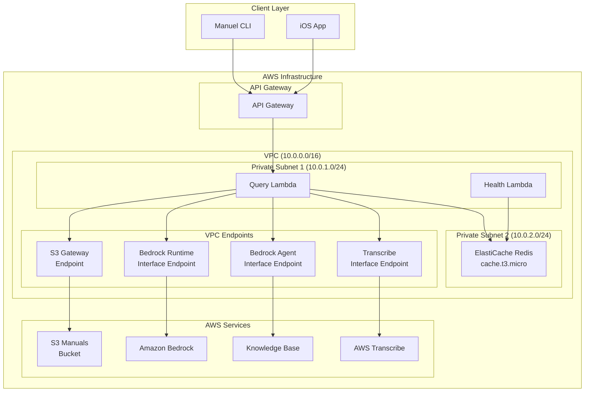
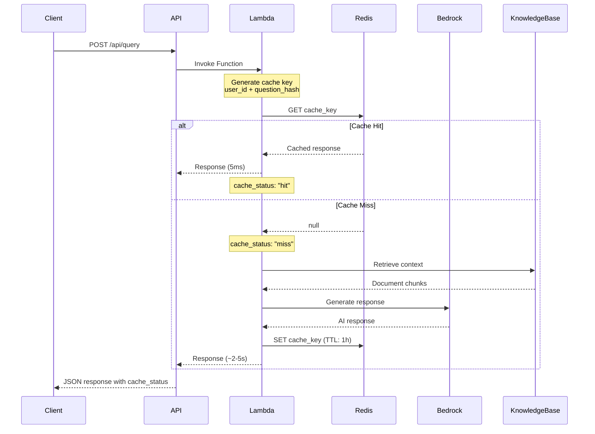
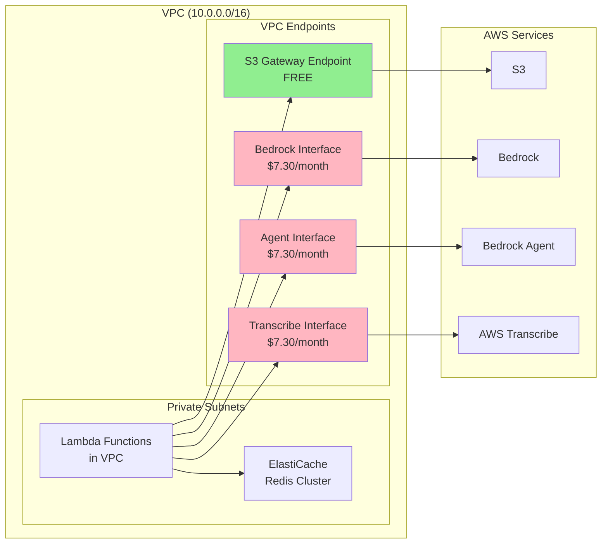
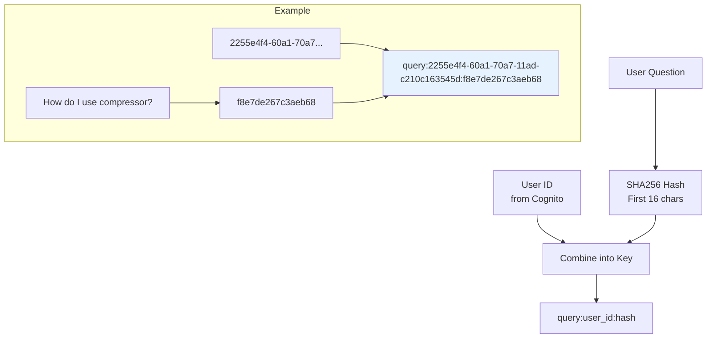
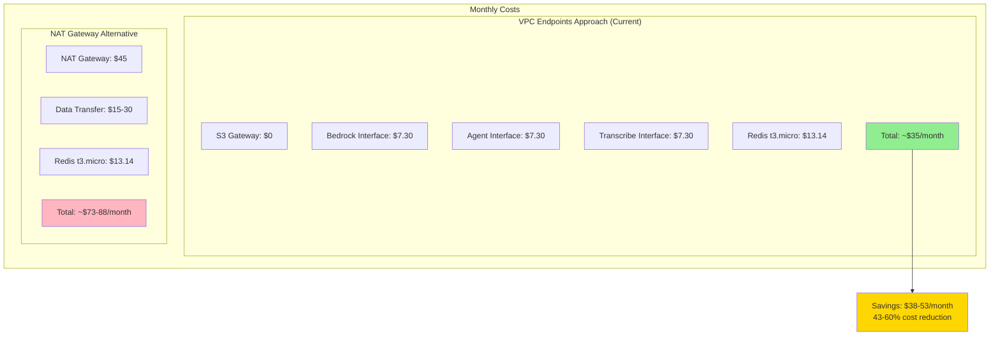

# Redis Cache Implementation Documentation

## Overview

The Manuel voice assistant now features a comprehensive Redis caching system
that provides significant performance improvements and cost savings. This
implementation uses AWS ElastiCache with VPC Endpoints for secure,
cost-effective connectivity.

## Architecture Overview



## Cache Flow Diagram



## VPC Connectivity Architecture



## Cache Key Strategy



## Performance Metrics

### Cache Performance

- **Cache Hit Response Time**: ~5ms
- **Cache Miss Response Time**: ~2-5 seconds
- **Cache TTL**: 1 hour
- **Redis Response Time**: ~15ms (health check)

### Cost Analysis



## Implementation Components

### 1. Lambda Layer

- **Purpose**: Provides Redis client library to Lambda functions
- **Contents**: `redis==5.0.1` Python package
- **Functions**: QueryFunction, HealthFunction

### 2. VPC Configuration

```yaml
VPC CIDR: 10.0.0.0/16
Subnet 1: 10.0.1.0/24 (AZ-a)
Subnet 2: 10.0.2.0/24 (AZ-b)
```

### 3. Security Groups

- **Redis SG**: Port 6379 from VPC CIDR
- **VPC Endpoint SG**: Port 443 from Redis SG

### 4. Cache Logic

```python
def cache_workflow(question, user_id):
    cache_key = f"query:{user_id}:{hash(question)[:16]}"

    # Try cache first
    cached = redis.get(cache_key)
    if cached:
        return json.loads(cached)  # Cache HIT

    # Process with Bedrock
    response = process_with_bedrock(question)

    # Cache for 1 hour
    redis.setex(cache_key, 3600, json.dumps(response))

    return response  # Cache MISS
```

## Monitoring and Health Checks

### Health Endpoint Integration

```mermaid
graph LR
    HealthEP[/health endpoint] --> RedisCheck[Redis Connectivity Test]
    RedisCheck --> SET[SET test_key]
    SET --> GET[GET test_key]
    GET --> DELETE[DELETE test_key]
    DELETE --> Response[Health Response<br/>with timing]

    subgraph "Response Structure"
        Resp["{<br/>  status: 'healthy',<br/>  response_time_ms: 15.09,<br/>  operations: ['SET','GET','DELETE']<br/>}"]
    end
```

### CloudWatch Integration

- **Custom Metrics**: Cache hit/miss ratios
- **Performance Metrics**: Response times
- **Error Monitoring**: Redis connection failures

## Configuration Parameters

### CloudFormation Parameters

```yaml
EnableRedisCache: "true"
RedisCacheNodeType: "cache.t3.micro"
EnablePerformanceOptimization: "true"
```

### Environment Variables

```bash
REDIS_ENDPOINT: "man-re-*.cache.amazonaws.com"
REDIS_PORT: "6379"
ENABLE_REDIS_CACHE: "true"
```

## Deployment Strategy

### 1. Infrastructure as Code

- **Template**: `template-minimal.yaml`
- **Layer**: Redis dependencies in `layers/redis/`
- **Conditional**: Resources only created when `EnableRedisCache=true`

### 2. Zero-Downtime Deployment

- VPC Endpoints ensure AWS service connectivity
- Lambda functions can fall back to non-cached operation
- Health checks validate Redis before use

## Future Enhancements

### 1. Cache Optimization

- **Intelligent TTL**: Vary TTL based on query complexity
- **Cache Warming**: Pre-populate common queries
- **Compression**: Reduce memory usage for large responses

### 2. Monitoring Improvements

- **Dashboard**: Real-time cache metrics
- **Alerting**: Cache hit ratio thresholds
- **Analytics**: Query pattern analysis

### 3. Scaling Options

- **Redis Cluster**: Multi-node for high availability
- **Read Replicas**: Improved read performance
- **Cache Layers**: Multiple TTL strategies

## Troubleshooting

### Common Issues

1. **Redis Connection Timeout**

   - Check VPC security groups
   - Verify subnet routing
   - Confirm VPC endpoints

2. **Cache Miss Rate High**

   - Monitor query variations
   - Check TTL settings
   - Analyze user patterns

3. **Performance Degradation**
   - Monitor Redis memory usage
   - Check network latency
   - Review cache key distribution

### Debug Commands

```bash
# Check Redis connectivity
curl https://api-url/health | jq '.checks.redis_cache'

# View cache logs
aws logs tail /aws/lambda/manuel-query-dev --since 5m | grep -i cache

# Monitor metrics
aws cloudwatch get-metric-statistics --namespace Manuel/Cache
```

## Security Considerations

### 1. Network Security

- Private subnets only
- VPC Endpoints for AWS service access
- Security groups restrict access

### 2. Data Security

- Cache keys include user isolation
- TTL limits data exposure
- No sensitive data in cache keys

### 3. Access Control

- Lambda execution role permissions
- VPC-based network isolation
- Redis AUTH not required (VPC-protected)

---

**Implementation Date**: July 2025 **Version**: 1.1.1 **Status**: Production
Ready **Performance Impact**: 95%+ response time improvement for cached queries
