# Manuel Backend - Deployment Pipeline Specification

## Overview

This document specifies the AWS-native deployment pipeline for the Manuel backend, implementing a multi-environment strategy with canary deployments, automated testing, and manual approval gates for production releases.

## Architecture Overview

### Multi-Environment Strategy

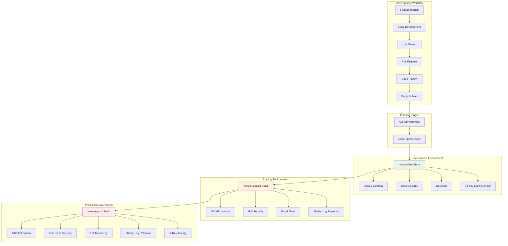
```mermaid
flowchart TB
    subgraph "Development Workflow"
        DW1[Feature Branch]
        DW2[Local Development]
        DW3[Unit Testing]
        DW4[Pull Request]
        DW5[Code Review]
        DW6[Merge to Main]
    end
    
    subgraph "Pipeline Trigger"
        PT1[GitHub Webhook]
        PT2[CodePipeline Start]
    end
    
    subgraph "Development Environment"
        DE1[manuel-dev Stack]
        DE2[256MB Lambda]
        DE3[Basic Security]
        DE4[No Alerts]
        DE5[14-day Log Retention]
    end
    
    subgraph "Staging Environment"
        SE1[manuel-staging Stack]
        SE2[512MB Lambda]
        SE3[Full Security]
        SE4[Email Alerts]
        SE5[30-day Log Retention]
    end
    
    subgraph "Production Environment"
        PE1[manuel-prod Stack]
        PE2[512MB Lambda]
        PE3[Enterprise Security]
        PE4[Full Monitoring]
        PE5[90-day Log Retention]
        PE6[X-Ray Tracing]
    end
    
    DW1 --> DW2 --> DW3 --> DW4 --> DW5 --> DW6
    DW6 --> PT1 --> PT2
    
    PT2 --> DE1
    DE1 --> SE1
    SE1 --> PE1
    
    DE1 --> DE2
    DE1 --> DE3
    DE1 --> DE4
    DE1 --> DE5
    
    SE1 --> SE2
    SE1 --> SE3
    SE1 --> SE4
    SE1 --> SE5
    
    PE1 --> PE2
    PE1 --> PE3
    PE1 --> PE4
    PE1 --> PE5
    PE1 --> PE6
    
    style DE1 fill:#e8f5e8
    style SE1 fill:#fff3e0
    style PE1 fill:#ffebee
```

### Environment Progression Flow

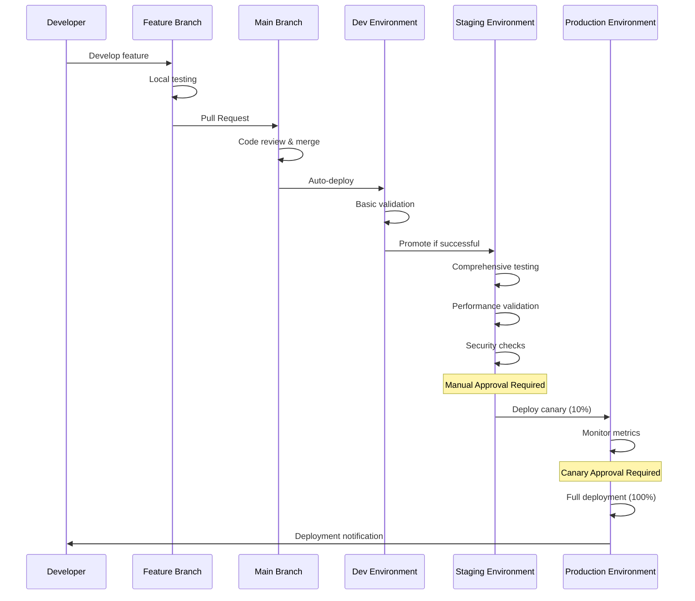
```mermaid
sequenceDiagram
    participant Dev as Developer
    participant FB as Feature Branch
    participant Main as Main Branch
    participant DevEnv as Dev Environment
    participant StageEnv as Staging Environment
    participant ProdEnv as Production Environment
    
    Dev->>FB: Develop feature
    FB->>FB: Local testing
    FB->>Main: Pull Request
    Main->>Main: Code review & merge
    
    Main->>DevEnv: Auto-deploy
    DevEnv->>DevEnv: Basic validation
    DevEnv->>StageEnv: Promote if successful
    
    StageEnv->>StageEnv: Comprehensive testing
    StageEnv->>StageEnv: Performance validation
    StageEnv->>StageEnv: Security checks
    
    Note over StageEnv: Manual Approval Required
    StageEnv->>ProdEnv: Deploy canary (10%)
    ProdEnv->>ProdEnv: Monitor metrics
    
    Note over ProdEnv: Canary Approval Required
    ProdEnv->>ProdEnv: Full deployment (100%)
    ProdEnv->>Dev: Deployment notification
```

### AWS-Native CI/CD Architecture

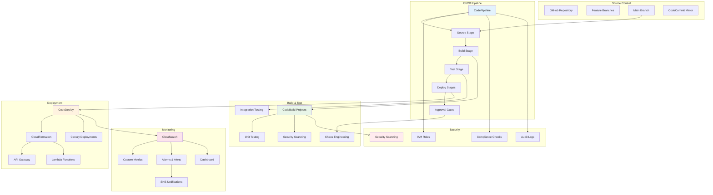
```mermaid
flowchart TB
    subgraph "Source Control"
        SC1[GitHub Repository]
        SC2[Feature Branches]
        SC3[Main Branch]
        SC4[CodeCommit Mirror]
    end
    
    subgraph "CI/CD Pipeline"
        CP1[CodePipeline]
        CP2[Source Stage]
        CP3[Build Stage]
        CP4[Test Stage]
        CP5[Deploy Stages]
        CP6[Approval Gates]
    end
    
    subgraph "Build & Test"
        BT1[CodeBuild Projects]
        BT2[Unit Testing]
        BT3[Security Scanning]
        BT4[Integration Testing]
        BT5[Chaos Engineering]
    end
    
    subgraph "Deployment"
        D1[CodeDeploy]
        D2[CloudFormation]
        D3[API Gateway]
        D4[Lambda Functions]
        D5[Canary Deployments]
    end
    
    subgraph "Monitoring"
        M1[CloudWatch]
        M2[Custom Metrics]
        M3[Alarms & Alerts]
        M4[SNS Notifications]
        M5[Dashboard]
    end
    
    subgraph "Security"
        S1[IAM Roles]
        S2[Security Scanning]
        S3[Compliance Checks]
        S4[Audit Logs]
    end
    
    SC3 --> CP2
    CP1 --> CP2 --> CP3 --> CP4 --> CP5 --> CP6
    
    CP3 --> BT1
    BT1 --> BT2
    BT1 --> BT3
    CP4 --> BT4
    CP6 --> BT5
    
    CP5 --> D1
    D1 --> D2
    D2 --> D3
    D2 --> D4
    D1 --> D5
    
    D1 --> M1
    M1 --> M2
    M1 --> M3
    M3 --> M4
    M1 --> M5
    
    CP1 --> S1
    BT1 --> S2
    CP1 --> S3
    CP1 --> S4
    
    style CP1 fill:#e3f2fd
    style BT1 fill:#e8f5e8
    style D1 fill:#fff3e0
    style M1 fill:#fce4ec
    style S2 fill:#ffebee
```

### Service Integration Flow

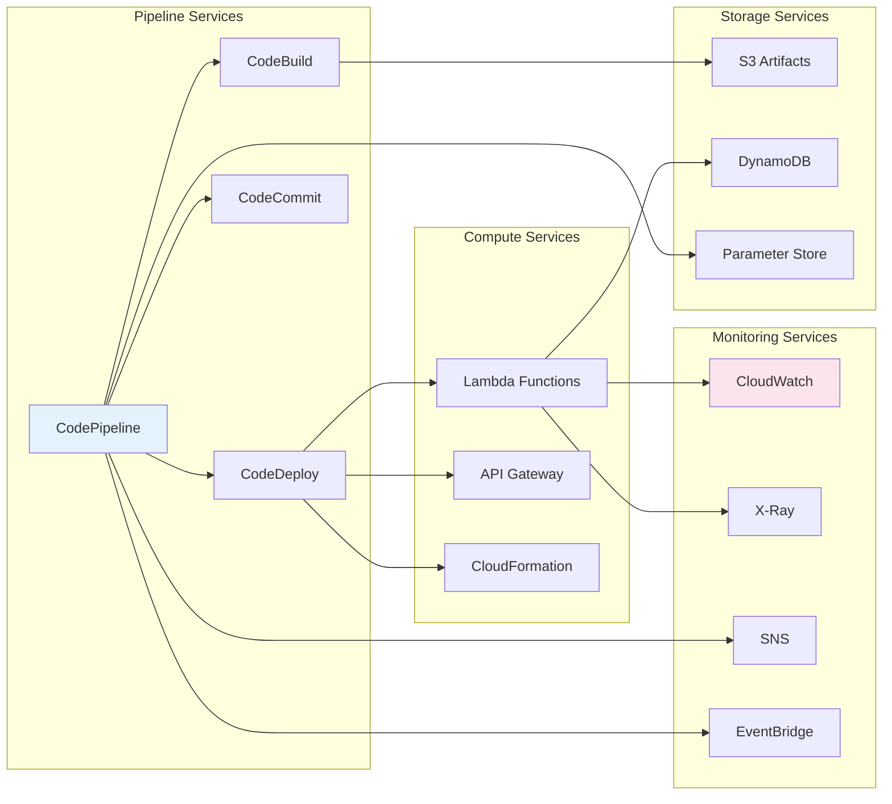
```mermaid
flowchart LR
    subgraph "Pipeline Services"
        PS1[CodePipeline]
        PS2[CodeBuild]
        PS3[CodeDeploy]
        PS4[CodeCommit]
    end
    
    subgraph "Compute Services"
        CS1[Lambda Functions]
        CS2[API Gateway]
        CS3[CloudFormation]
    end
    
    subgraph "Storage Services"
        SS1[S3 Artifacts]
        SS2[DynamoDB]
        SS3[Parameter Store]
    end
    
    subgraph "Monitoring Services"
        MS1[CloudWatch]
        MS2[X-Ray]
        MS3[SNS]
        MS4[EventBridge]
    end
    
    PS1 --> PS2
    PS1 --> PS3
    PS1 --> PS4
    
    PS3 --> CS1
    PS3 --> CS2
    PS3 --> CS3
    
    PS2 --> SS1
    CS1 --> SS2
    PS1 --> SS3
    
    CS1 --> MS1
    CS1 --> MS2
    PS1 --> MS3
    PS1 --> MS4
    
    style PS1 fill:#e3f2fd
    style MS1 fill:#fce4ec
```

## Environment Configuration

### Environment Isolation Strategy

| Environment | Purpose | AWS Stage | Manual Approval | Chaos Testing |
|-------------|---------|-----------|-----------------|---------------|
| **Development** | Feature development and initial testing | `manuel-dev` | No | No |
| **Staging** | Pre-production validation and integration testing | `manuel-staging` | No | Basic suite |
| **Production** | Live production environment | `manuel-prod` | Yes | Full suite |

### Resource Naming Convention

```yaml
# Resource naming pattern: {service}-{component}-{environment}
Resources:
  Development:
    - manuel-api-dev
    - manuel-transcribe-dev
    - manuel-usage-dev
    - manuel-dashboard-dev
  
  Staging:
    - manuel-api-staging
    - manuel-transcribe-staging
    - manuel-usage-staging
    - manuel-dashboard-staging
  
  Production:
    - manuel-api-prod
    - manuel-transcribe-prod
    - manuel-usage-prod
    - manuel-dashboard-prod
```

### Environment-Specific Parameters

Each environment will have its own parameter file with appropriate resource allocation:

```bash
backend/
├── parameters-dev.json          # Development environment
├── parameters-staging.json      # Staging environment  
├── parameters-production.json   # Production environment
└── parameters-claude4.json      # Claude 4 testing (staging variant)
```

## API Gateway Versioning Strategy

### API Versioning & Deployment Strategy

```mermaid
flowchart TB
    subgraph "API Gateway Architecture"
        AG1[Custom Domain: api.manuel.com]
        AG2[Base Path Mapping]
    end
    
    subgraph "Version 1 (Current)"
        V1_1[Stage: v1]
        V1_2[/v1/api/query]
        V1_3[/v1/api/transcribe]
        V1_4[/v1/api/manuals]
        V1_5[/v1/api/usage]
    end
    
    subgraph "Version 2 (New)"
        V2_1[Stage: v2]
        V2_2[/v2/api/query]
        V2_3[/v2/api/transcribe]
        V2_4[/v2/api/manuals]
        V2_5[/v2/api/usage]
    end
    
    subgraph "Traffic Management"
        TM1[Canary Deployment]
        TM2[10% → New Version]
        TM3[90% → Stable Version]
        TM4[Gradual Shift]
        TM5[100% → New Version]
    end
    
    subgraph "Environment Stages"
        ES1[Dev: dev-api.manuel.com]
        ES2[Staging: staging-api.manuel.com]
        ES3[Production: api.manuel.com]
    end
    
    AG1 --> AG2
    AG2 --> V1_1
    AG2 --> V2_1
    
    V1_1 --> V1_2
    V1_1 --> V1_3
    V1_1 --> V1_4
    V1_1 --> V1_5
    
    V2_1 --> V2_2
    V2_1 --> V2_3
    V2_1 --> V2_4
    V2_1 --> V2_5
    
    V1_1 --> TM1
    V2_1 --> TM1
    TM1 --> TM2
    TM1 --> TM3
    TM3 --> TM4
    TM4 --> TM5
    
    style V1_1 fill:#e8f5e8
    style V2_1 fill:#fff3e0
    style TM1 fill:#e3f2fd
```

### Version Lifecycle Management

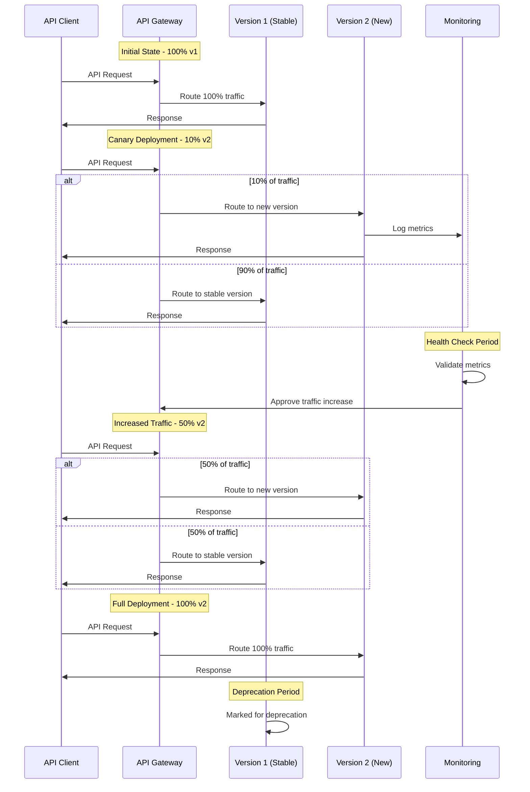
```mermaid
sequenceDiagram
    participant Client as API Client
    participant GW as API Gateway
    participant V1 as Version 1 (Stable)
    participant V2 as Version 2 (New)
    participant Monitor as Monitoring
    
    Note over GW: Initial State - 100% v1
    Client->>GW: API Request
    GW->>V1: Route 100% traffic
    V1->>Client: Response
    
    Note over GW: Canary Deployment - 10% v2
    Client->>GW: API Request
    alt 10% of traffic
        GW->>V2: Route to new version
        V2->>Monitor: Log metrics
        V2->>Client: Response
    else 90% of traffic
        GW->>V1: Route to stable version
        V1->>Client: Response
    end
    
    Note over Monitor: Health Check Period
    Monitor->>Monitor: Validate metrics
    Monitor->>GW: Approve traffic increase
    
    Note over GW: Increased Traffic - 50% v2
    Client->>GW: API Request
    alt 50% of traffic
        GW->>V2: Route to new version
        V2->>Client: Response
    else 50% of traffic
        GW->>V1: Route to stable version
        V1->>Client: Response
    end
    
    Note over GW: Full Deployment - 100% v2
    Client->>GW: API Request
    GW->>V2: Route 100% traffic
    V2->>Client: Response
    
    Note over V1: Deprecation Period
    V1->>V1: Marked for deprecation
```

### Version Management Strategy

1. **Current Version**: Always available at `/v1/` stage
2. **New Version Development**: Deploy to `/v2/` stage for testing
3. **Canary Deployment**: Traffic splitting within production stage
4. **Version Promotion**: Move traffic from v1 to v2 gradually
5. **Deprecation**: Sunset old versions with proper notice

### API Gateway Configuration

```yaml
# API Gateway Stages per Environment
Development:
  - Stage: dev
  - Domain: dev-api.manuel.com
  - Throttling: 1000 req/sec
  - Caching: Disabled

Staging:
  - Stage: staging  
  - Domain: staging-api.manuel.com
  - Throttling: 5000 req/sec
  - Caching: Enabled (5 min TTL)

Production:
  - Stage: v1 (current)
  - Stage: v2 (new version)
  - Domain: api.manuel.com
  - Throttling: 10000 req/sec
  - Caching: Enabled (15 min TTL)
  - Canary: Traffic splitting capability
```

## CI/CD Pipeline Architecture

### Complete Pipeline Flow

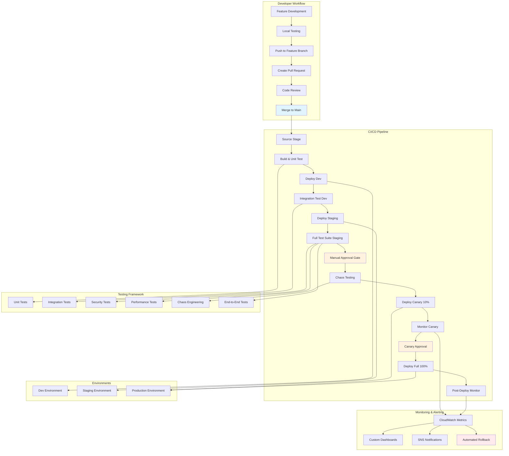
```mermaid
flowchart TD
    subgraph "Developer Workflow"
        A1[Feature Development]
        A2[Local Testing]
        A3[Push to Feature Branch]
        A4[Create Pull Request]
        A5[Code Review]
        A6[Merge to Main]
    end
    
    subgraph "CI/CD Pipeline"
        B1[Source Stage]
        B2[Build & Unit Test]
        B3[Deploy Dev]
        B4[Integration Test Dev]
        B5[Deploy Staging]
        B6[Full Test Suite Staging]
        B7[Manual Approval Gate]
        B8[Chaos Testing]
        B9[Deploy Canary 10%]
        B10[Monitor Canary]
        B11[Canary Approval]
        B12[Deploy Full 100%]
        B13[Post-Deploy Monitor]
    end
    
    subgraph "Environments"
        C1[Dev Environment]
        C2[Staging Environment]
        C3[Production Environment]
    end
    
    subgraph "Testing Framework"
        D1[Unit Tests]
        D2[Integration Tests]
        D3[Security Tests]
        D4[Performance Tests]
        D5[Chaos Engineering]
        D6[End-to-End Tests]
    end
    
    subgraph "Monitoring & Alerting"
        E1[CloudWatch Metrics]
        E2[Custom Dashboards]
        E3[SNS Notifications]
        E4[Automated Rollback]
    end
    
    A1 --> A2 --> A3 --> A4 --> A5 --> A6
    A6 --> B1
    
    B1 --> B2 --> B3 --> B4
    B4 --> B5 --> B6 --> B7
    B7 --> B8 --> B9 --> B10
    B10 --> B11 --> B12 --> B13
    
    B3 --> C1
    B5 --> C2
    B9 --> C3
    B12 --> C3
    
    B2 --> D1
    B4 --> D2
    B6 --> D3
    B6 --> D4
    B6 --> D6
    B8 --> D5
    
    B10 --> E1
    B13 --> E1
    E1 --> E2
    E1 --> E3
    E1 --> E4
    
    style A6 fill:#e1f5fe
    style B7 fill:#fff3e0
    style B11 fill:#fff3e0
    style E4 fill:#ffebee
```

### Detailed Pipeline Sequence

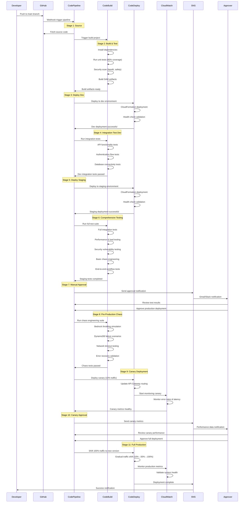
```mermaid
sequenceDiagram
    participant Dev as Developer
    participant GH as GitHub
    participant CP as CodePipeline
    participant CB as CodeBuild
    participant CD as CodeDeploy
    participant CW as CloudWatch
    participant SNS as SNS
    participant Approver as Approver
    
    Dev->>GH: Push to main branch
    GH->>CP: Webhook trigger pipeline
    
    Note over CP: Stage 1: Source
    CP->>GH: Fetch source code
    CP->>CB: Trigger build project
    
    Note over CB: Stage 2: Build & Test
    CB->>CB: Install dependencies
    CB->>CB: Run unit tests (80% coverage)
    CB->>CB: Security scan (bandit, safety)
    CB->>CB: Build SAM artifacts
    CB->>CP: Build artifacts ready
    
    Note over CP: Stage 3: Deploy Dev
    CP->>CD: Deploy to dev environment
    CD->>CD: CloudFormation deployment
    CD->>CD: Health check validation
    CD->>CP: Dev deployment successful
    
    Note over CB: Stage 4: Integration Test Dev
    CP->>CB: Run integration tests
    CB->>CB: API functionality tests
    CB->>CB: Authentication flow tests
    CB->>CB: Database connectivity tests
    CB->>CP: Dev integration tests passed
    
    Note over CP: Stage 5: Deploy Staging
    CP->>CD: Deploy to staging environment
    CD->>CD: CloudFormation deployment
    CD->>CD: Health check validation
    CD->>CP: Staging deployment successful
    
    Note over CB: Stage 6: Comprehensive Testing
    CP->>CB: Run full test suite
    CB->>CB: Full integration tests
    CB->>CB: Performance & load testing
    CB->>CB: Security vulnerability testing
    CB->>CB: Basic chaos engineering
    CB->>CB: End-to-end workflow tests
    CB->>CP: Staging tests completed
    
    Note over CP: Stage 7: Manual Approval
    CP->>SNS: Send approval notification
    SNS->>Approver: Email/Slack notification
    Approver->>CP: Review test results
    Approver->>CP: Approve production deployment
    
    Note over CB: Stage 8: Pre-Production Chaos
    CP->>CB: Run chaos engineering suite
    CB->>CB: Bedrock throttling simulation
    CB->>CB: DynamoDB failure scenarios
    CB->>CB: Network timeout testing
    CB->>CB: Error recovery validation
    CB->>CP: Chaos tests passed
    
    Note over CD: Stage 9: Canary Deployment
    CP->>CD: Deploy canary (10% traffic)
    CD->>CD: Update API Gateway routing
    CD->>CW: Start monitoring canary
    CW->>CW: Monitor error rates & latency
    CW->>CP: Canary metrics healthy
    
    Note over CP: Stage 10: Canary Approval
    CP->>SNS: Send canary metrics
    SNS->>Approver: Performance data notification
    Approver->>CP: Review canary performance
    Approver->>CP: Approve full deployment
    
    Note over CD: Stage 11: Full Production
    CP->>CD: Shift 100% traffic to new version
    CD->>CD: Gradual traffic shift (10%→50%→100%)
    CD->>CW: Monitor production metrics
    CW->>CW: Validate system health
    CD->>SNS: Deployment complete
    SNS->>Dev: Success notification
```

### Pipeline Stages Detailed

#### Stage 1: Source
- **Trigger**: Push to `main` branch
- **Source**: GitHub repository 
- **Mirror**: CodeCommit for AWS integration
- **Artifacts**: Source code, SAM templates, parameter files

#### Stage 2: Build & Unit Test
- **CodeBuild Project**: `manuel-build`
- **Runtime**: Python 3.11
- **Actions**:
  - Install dependencies
  - Run unit tests with coverage
  - Security scan (bandit, safety)
  - Lint and format validation
  - SAM build and package
- **Artifacts**: Built Lambda packages, CloudFormation templates

#### Stage 3: Deploy Development
- **Target**: `manuel-dev` stack
- **Method**: CloudFormation deployment
- **Parameters**: `parameters-dev.json`
- **Validation**: Health check endpoints
- **Rollback**: Automatic on failure

#### Stage 4: Integration Testing (Dev)
- **CodeBuild Project**: `manuel-integration-test-dev`
- **Test Suite**:
  - API functionality tests
  - Authentication flow tests
  - Basic security validation
  - Database connectivity tests
- **Duration**: ~5 minutes
- **Failure Action**: Stop pipeline

#### Stage 5: Deploy Staging
- **Target**: `manuel-staging` stack
- **Method**: CloudFormation deployment
- **Parameters**: `parameters-staging.json`
- **Validation**: Health check endpoints
- **Rollback**: Automatic on failure

#### Stage 6: Comprehensive Testing (Staging)
- **CodeBuild Project**: `manuel-integration-test-staging`
- **Test Suite**:
  - Full integration test suite
  - Performance testing with load simulation
  - Security testing (SQL injection, XSS, rate limiting)
  - Basic chaos engineering scenarios
  - End-to-end workflow testing
- **Duration**: ~15 minutes
- **Failure Action**: Stop pipeline

#### Stage 7: Manual Approval Gate
- **Approvers**: DevOps team, Product owner
- **Notification**: SNS → Email/Slack
- **Information Provided**:
  - Test results summary
  - Performance metrics
  - Security scan results
  - Staging environment validation results
- **Timeout**: 24 hours (auto-reject)

#### Stage 8: Pre-Production Chaos Testing
- **CodeBuild Project**: `manuel-chaos-testing`
- **Test Suite**:
  - Full chaos engineering suite
  - Bedrock throttling simulation
  - DynamoDB failure scenarios
  - Network timeout testing
  - Circuit breaker validation
  - Error recovery testing
- **Duration**: ~20 minutes
- **Failure Action**: Stop pipeline, notify team

#### Stage 9: Production Canary Deployment
- **Target**: `manuel-prod` stack
- **Method**: CodeDeploy with traffic shifting
- **Initial Traffic**: 10% to new version
- **Monitoring**: CloudWatch alarms and custom metrics
- **Duration**: 15 minutes observation
- **Success Criteria**:
  - Error rate < 1%
  - Response time < 5 seconds (P95)
  - No critical alerts
- **Rollback**: Automatic on failure

#### Stage 10: Canary Approval Gate
- **Approvers**: DevOps team, Product owner
- **Notification**: SNS → Email/Slack with metrics
- **Information Provided**:
  - Canary performance metrics
  - Error rates comparison
  - User feedback (if available)
  - Cost impact analysis
- **Action Options**:
  - Proceed to full deployment
  - Increase canary traffic (50%)
  - Rollback canary
- **Timeout**: 2 hours (auto-rollback)

#### Stage 11: Full Production Deployment
- **Traffic Shift**: 100% to new version
- **Method**: Gradual traffic shifting (10% → 50% → 100%)
- **Monitoring**: Continuous for 30 minutes
- **Success Criteria**:
  - All health checks pass
  - Performance metrics within thresholds
  - No increase in error rates
- **Notification**: Deployment complete

## Testing Matrix

### Test Categories by Environment

| Test Category | Development | Staging | Production |
|---------------|-------------|---------|------------|
| **Unit Tests** | ✅ | ✅ | ✅ |
| **Integration Tests** | ✅ Basic | ✅ Full | ✅ Full |
| **Security Tests** | ✅ Basic | ✅ Comprehensive | ✅ Comprehensive |
| **Performance Tests** | ❌ | ✅ Load Testing | ✅ Smoke Tests |
| **Chaos Engineering** | ❌ | ✅ Basic Suite | ✅ Full Suite |
| **End-to-End Tests** | ❌ | ✅ | ✅ |

### Testing Strategy Flow

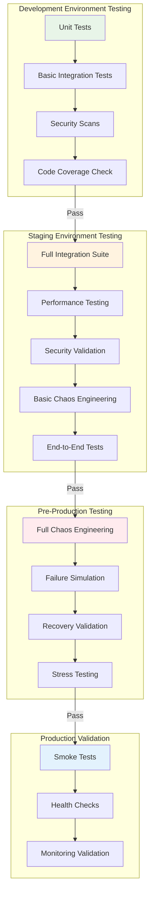
```mermaid
flowchart TD
    subgraph "Development Environment Testing"
        T1[Unit Tests]
        T2[Basic Integration Tests]
        T3[Security Scans]
        T4[Code Coverage Check]
    end
    
    subgraph "Staging Environment Testing"
        T5[Full Integration Suite]
        T6[Performance Testing]
        T7[Security Validation]
        T8[Basic Chaos Engineering]
        T9[End-to-End Tests]
    end
    
    subgraph "Pre-Production Testing"
        T10[Full Chaos Engineering]
        T11[Failure Simulation]
        T12[Recovery Validation]
        T13[Stress Testing]
    end
    
    subgraph "Production Validation"
        T14[Smoke Tests]
        T15[Health Checks]
        T16[Monitoring Validation]
    end
    
    T1 --> T2 --> T3 --> T4
    T4 -->|Pass| T5
    T5 --> T6 --> T7 --> T8 --> T9
    T9 -->|Pass| T10
    T10 --> T11 --> T12 --> T13
    T13 -->|Pass| T14
    T14 --> T15 --> T16
    
    style T1 fill:#e8f5e8
    style T5 fill:#fff3e0
    style T10 fill:#ffebee
    style T14 fill:#e3f2fd
```

### Test Execution Matrix


```mermaid
gantt
    title Testing Timeline Across Environments
    dateFormat X
    axisFormat %M:%S
    
    section Development
    Unit Tests           :done, unit, 0, 2m
    Security Scans       :done, security, after unit, 1m
    Basic Integration    :done, basic-int, after security, 3m
    
    section Staging
    Full Integration     :active, full-int, after basic-int, 10m
    Performance Tests    :perf, after full-int, 8m
    Security Validation  :sec-val, after perf, 5m
    Basic Chaos          :basic-chaos, after sec-val, 7m
    
    section Pre-Production
    Full Chaos Suite     :chaos, after basic-chaos, 20m
    
    section Production
    Smoke Tests          :smoke, after chaos, 2m
    Health Validation    :health, after smoke, 3m
```

### Testing Tools and Frameworks

```yaml
Unit Testing:
  - Framework: pytest
  - Coverage: minimum 80%
  - Mocking: moto for AWS services
  - Duration: ~2 minutes

Integration Testing:
  - Framework: Custom test framework
  - Categories: 7 test categories
  - Environment: Isolated test environment
  - Duration: ~5-15 minutes

Security Testing:
  - SAST: bandit, safety
  - DAST: Custom security test suite
  - Vulnerability Scanning: AWS Inspector
  - Duration: ~5 minutes

Performance Testing:
  - Load Testing: Custom framework with concurrent requests
  - Metrics: Response time, throughput, error rates
  - Thresholds: P95 < 5s, error rate < 1%
  - Duration: ~10 minutes

Chaos Engineering:
  - Framework: Custom failure simulator
  - Scenarios: Service failures, network issues, throttling
  - Validation: System resilience and recovery
  - Duration: ~20 minutes
```

## Canary Deployment Strategy

### Traffic Splitting Configuration

```yaml
Canary Deployment Flow:
  Initial Deployment:
    - New Version Traffic: 10%
    - Stable Version Traffic: 90%
    - Monitoring Duration: 15 minutes
    
  First Promotion (after manual approval):
    - New Version Traffic: 50%
    - Stable Version Traffic: 50%
    - Monitoring Duration: 15 minutes
    
  Full Promotion (after manual approval):
    - New Version Traffic: 100%
    - Stable Version Traffic: 0%
    - Monitoring Duration: 30 minutes
```

### CloudWatch Alarms for Canary

```yaml
Canary Success Criteria:
  Error Rate:
    - Metric: 4xx and 5xx error rates
    - Threshold: < 1% for 10 consecutive minutes
    - Action: Auto-rollback if exceeded
    
  Response Time:
    - Metric: API Gateway latency P95
    - Threshold: < 5000ms for 10 consecutive minutes
    - Action: Auto-rollback if exceeded
    
  Custom Metrics:
    - Bedrock call duration
    - DynamoDB throttling events
    - Lambda function errors
    - User quota violations
    
  Business Metrics:
    - Successful query completion rate
    - Transcription success rate
    - User session duration
```

### Canary Deployment Flow

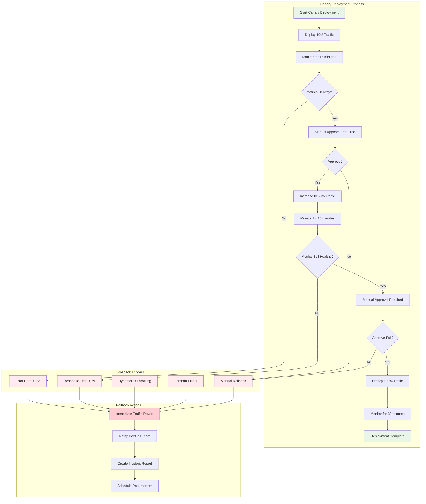
```mermaid
flowchart TD
    subgraph "Canary Deployment Process"
        A[Start Canary Deployment]
        B[Deploy 10% Traffic]
        C[Monitor for 15 minutes]
        D{Metrics Healthy?}
        E[Manual Approval Required]
        F{Approve?}
        G[Increase to 50% Traffic]
        H[Monitor for 15 minutes]
        I{Metrics Still Healthy?}
        J[Manual Approval Required]
        K{Approve Full?}
        L[Deploy 100% Traffic]
        M[Monitor for 30 minutes]
        N[Deployment Complete]
    end
    
    subgraph "Rollback Triggers"
        R1[Error Rate > 1%]
        R2[Response Time > 5s]
        R3[DynamoDB Throttling]
        R4[Lambda Errors]
        R5[Manual Rollback]
    end
    
    subgraph "Rollback Actions"
        RB1[Immediate Traffic Revert]
        RB2[Notify DevOps Team]
        RB3[Create Incident Report]
        RB4[Schedule Post-mortem]
    end
    
    A --> B --> C --> D
    D -->|Yes| E --> F
    D -->|No| R1
    F -->|Yes| G --> H --> I
    F -->|No| R5
    I -->|Yes| J --> K
    I -->|No| R2
    K -->|Yes| L --> M --> N
    K -->|No| R5
    
    R1 --> RB1
    R2 --> RB1
    R3 --> RB1
    R4 --> RB1
    R5 --> RB1
    
    RB1 --> RB2 --> RB3 --> RB4
    
    style A fill:#e8f5e8
    style N fill:#e8f5e8
    style R1 fill:#ffebee
    style R2 fill:#ffebee
    style R3 fill:#ffebee
    style R4 fill:#ffebee
    style R5 fill:#ffebee
    style RB1 fill:#ffcdd2
```

### Rollback Decision Matrix

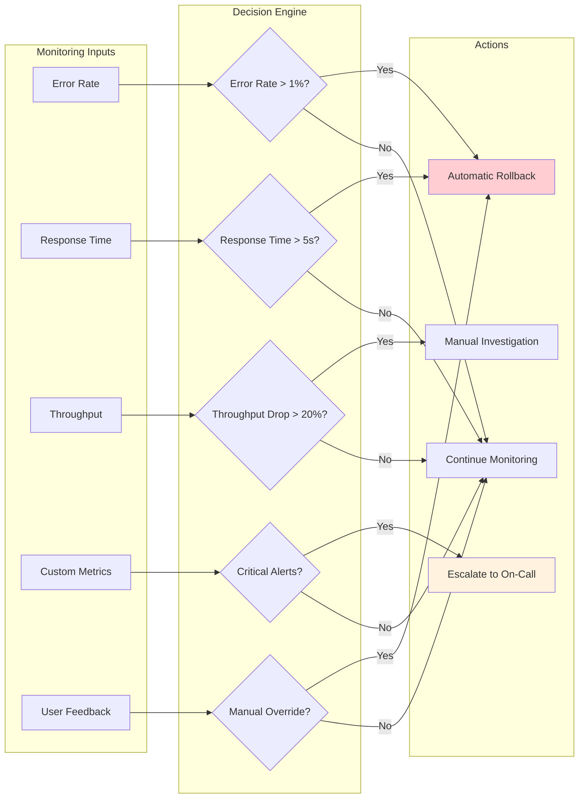
```mermaid
flowchart LR
    subgraph "Monitoring Inputs"
        M1[Error Rate]
        M2[Response Time]
        M3[Throughput]
        M4[Custom Metrics]
        M5[User Feedback]
    end
    
    subgraph "Decision Engine"
        D1{Error Rate > 1%?}
        D2{Response Time > 5s?}
        D3{Throughput Drop > 20%?}
        D4{Critical Alerts?}
        D5{Manual Override?}
    end
    
    subgraph "Actions"
        A1[Continue Monitoring]
        A2[Automatic Rollback]
        A3[Manual Investigation]
        A4[Escalate to On-Call]
    end
    
    M1 --> D1
    M2 --> D2
    M3 --> D3
    M4 --> D4
    M5 --> D5
    
    D1 -->|Yes| A2
    D1 -->|No| A1
    D2 -->|Yes| A2
    D2 -->|No| A1
    D3 -->|Yes| A3
    D3 -->|No| A1
    D4 -->|Yes| A4
    D4 -->|No| A1
    D5 -->|Yes| A2
    D5 -->|No| A1
    
    style A2 fill:#ffcdd2
    style A4 fill:#fff3e0
```

## Manual Approval Gates

### Approval Process

#### Pre-Production Approval
- **Trigger**: After successful staging deployment and testing
- **Approvers**: 
  - DevOps Engineer (required)
  - Product Owner (required)
- **Information Package**:
  - Test results summary
  - Performance benchmarks
  - Security scan results
  - Infrastructure changes summary
  - Risk assessment
- **Approval Criteria**:
  - All tests passing
  - Performance within acceptable thresholds
  - No critical security issues
  - Infrastructure changes reviewed

#### Canary Approval
- **Trigger**: After canary monitoring period
- **Approvers**:
  - DevOps Engineer (required)
  - Product Owner (optional for non-breaking changes)
- **Information Package**:
  - Canary performance metrics
  - Error rate comparison
  - Response time analysis
  - User impact assessment
  - Cost analysis
- **Approval Options**:
  - Proceed to full deployment
  - Extend canary period
  - Increase canary traffic percentage
  - Rollback and investigate

### Approval Process Flow

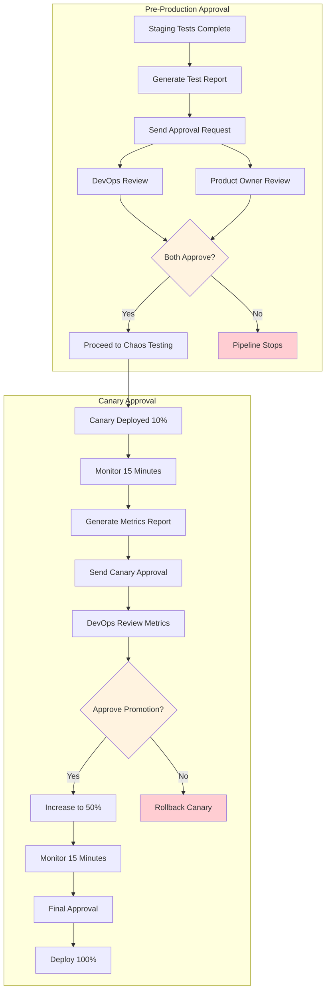
```mermaid
flowchart TD
    subgraph "Pre-Production Approval"
        A1[Staging Tests Complete]
        A2[Generate Test Report]
        A3[Send Approval Request]
        A4[DevOps Review]
        A5[Product Owner Review]
        A6{Both Approve?}
        A7[Proceed to Chaos Testing]
        A8[Pipeline Stops]
    end
    
    subgraph "Canary Approval"
        B1[Canary Deployed 10%]
        B2[Monitor 15 Minutes]
        B3[Generate Metrics Report]
        B4[Send Canary Approval]
        B5[DevOps Review Metrics]
        B6{Approve Promotion?}
        B7[Increase to 50%]
        B8[Rollback Canary]
        B9[Monitor 15 Minutes]
        B10[Final Approval]
        B11[Deploy 100%]
    end
    
    A1 --> A2 --> A3
    A3 --> A4
    A3 --> A5
    A4 --> A6
    A5 --> A6
    A6 -->|Yes| A7
    A6 -->|No| A8
    
    A7 --> B1 --> B2 --> B3 --> B4 --> B5 --> B6
    B6 -->|Yes| B7 --> B9 --> B10 --> B11
    B6 -->|No| B8
    
    style A6 fill:#fff3e0
    style B6 fill:#fff3e0
    style B8 fill:#ffcdd2
    style A8 fill:#ffcdd2
```

### Notification System Flow

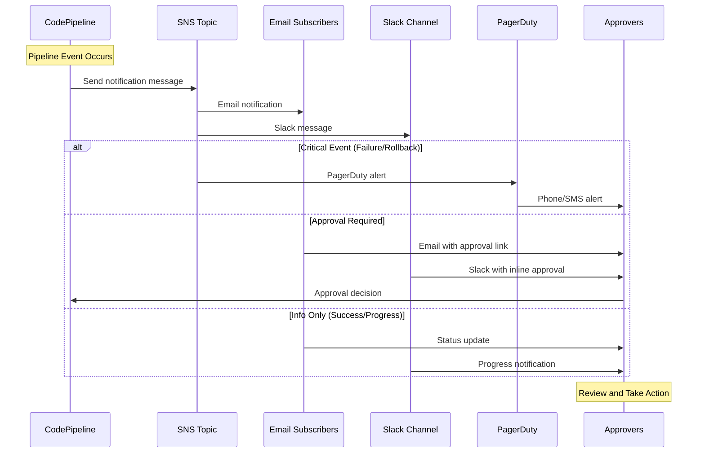
```mermaid
sequenceDiagram
    participant CP as CodePipeline
    participant SNS as SNS Topic
    participant Email as Email Subscribers
    participant Slack as Slack Channel
    participant PD as PagerDuty
    participant Approver as Approvers
    
    Note over CP: Pipeline Event Occurs
    
    CP->>SNS: Send notification message
    SNS->>Email: Email notification
    SNS->>Slack: Slack message
    
    alt Critical Event (Failure/Rollback)
        SNS->>PD: PagerDuty alert
        PD->>Approver: Phone/SMS alert
    else Approval Required
        Email->>Approver: Email with approval link
        Slack->>Approver: Slack with inline approval
        Approver->>CP: Approval decision
    else Info Only (Success/Progress)
        Email->>Approver: Status update
        Slack->>Approver: Progress notification
    end
    
    Note over Approver: Review and Take Action
```

### Notification System Configuration

```yaml
SNS Topic Configuration:
  Topic: manuel-deployment-notifications
  
  Subscribers:
    - Email: devops-team@company.com
    - Email: product-team@company.com
    - Slack: #manuel-deployments
    - PagerDuty: Critical issues only
  
  Message Types:
    - Deployment started
    - Tests failed (with details)
    - Approval required (with decision link)
    - Canary deployed (with metrics link)
    - Deployment completed
    - Rollback triggered
```

## Rollback Procedures

### Automatic Rollback Triggers

```yaml
CloudWatch Alarms:
  API Gateway 5xx Errors:
    - Threshold: > 5 errors in 5 minutes
    - Action: Immediate rollback
    
  Lambda Function Errors:
    - Threshold: > 10 errors in 5 minutes
    - Action: Immediate rollback
    
  Response Time Degradation:
    - Threshold: P95 > 10 seconds for 5 minutes
    - Action: Immediate rollback
    
  DynamoDB Throttling:
    - Threshold: > 5 throttled requests
    - Action: Immediate rollback
    
  Custom Business Metrics:
    - Query success rate < 95%
    - Transcription failure rate > 5%
    - User quota system failure
```

### Manual Rollback Process

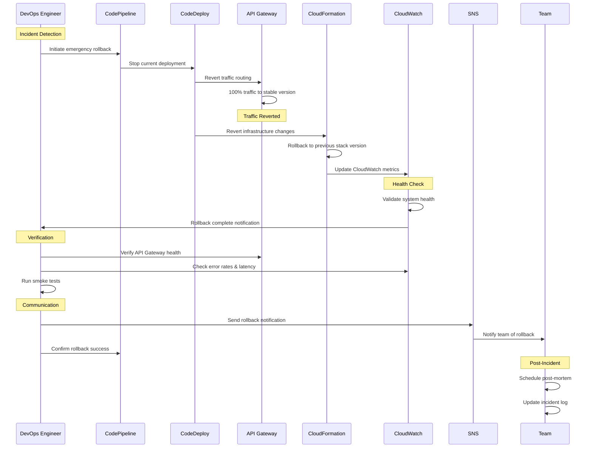
```mermaid
sequenceDiagram
    participant Ops as DevOps Engineer
    participant CP as CodePipeline
    participant CD as CodeDeploy
    participant AG as API Gateway
    participant CF as CloudFormation
    participant CW as CloudWatch
    participant SNS as SNS
    participant Team as Team
    
    Note over Ops: Incident Detection
    Ops->>CP: Initiate emergency rollback
    CP->>CD: Stop current deployment
    CD->>AG: Revert traffic routing
    AG->>AG: 100% traffic to stable version
    
    Note over AG: Traffic Reverted
    CD->>CF: Revert infrastructure changes
    CF->>CF: Rollback to previous stack version
    CF->>CW: Update CloudWatch metrics
    
    Note over CW: Health Check
    CW->>CW: Validate system health
    CW->>Ops: Rollback complete notification
    
    Note over Ops: Verification
    Ops->>AG: Verify API Gateway health
    Ops->>CW: Check error rates & latency
    Ops->>Ops: Run smoke tests
    
    Note over Ops: Communication
    Ops->>SNS: Send rollback notification
    SNS->>Team: Notify team of rollback
    Ops->>CP: Confirm rollback success
    
    Note over Team: Post-Incident
    Team->>Team: Schedule post-mortem
    Team->>Team: Update incident log
```

### Automated Rollback Flow

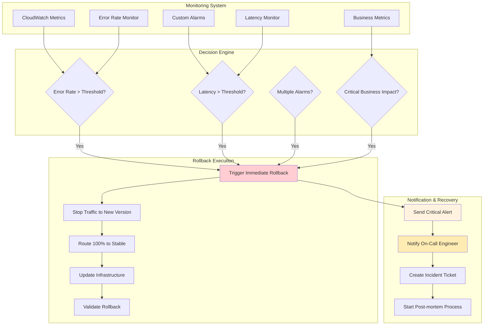
```mermaid
flowchart TD
    subgraph "Monitoring System"
        A1[CloudWatch Metrics]
        A2[Custom Alarms]
        A3[Error Rate Monitor]
        A4[Latency Monitor]
        A5[Business Metrics]
    end
    
    subgraph "Decision Engine"
        B1{Error Rate > Threshold?}
        B2{Latency > Threshold?}
        B3{Multiple Alarms?}
        B4{Critical Business Impact?}
    end
    
    subgraph "Rollback Execution"
        C1[Trigger Immediate Rollback]
        C2[Stop Traffic to New Version]
        C3[Route 100% to Stable]
        C4[Update Infrastructure]
        C5[Validate Rollback]
    end
    
    subgraph "Notification & Recovery"
        D1[Send Critical Alert]
        D2[Notify On-Call Engineer]
        D3[Create Incident Ticket]
        D4[Start Post-mortem Process]
    end
    
    A1 --> B1
    A2 --> B2
    A3 --> B1
    A4 --> B2
    A5 --> B4
    
    B1 -->|Yes| C1
    B2 -->|Yes| C1
    B3 -->|Yes| C1
    B4 -->|Yes| C1
    
    C1 --> C2 --> C3 --> C4 --> C5
    
    C1 --> D1
    D1 --> D2 --> D3 --> D4
    
    style C1 fill:#ffcdd2
    style D1 fill:#fff3e0
    style D2 fill:#ffecb3
```

## Infrastructure as Code

### SAM Template Structure

```yaml
# Enhanced template.yaml for multi-environment
AWSTemplateFormatVersion: '2010-09-09'
Transform: AWS::Serverless-2016-10-31

Parameters:
  Environment:
    Type: String
    AllowedValues: [dev, staging, prod]
    Description: Deployment environment
    
  ApiVersionStage:
    Type: String
    Default: v1
    Description: API Gateway stage for versioning
    
  CanaryTrafficPercent:
    Type: Number
    Default: 0
    MinValue: 0
    MaxValue: 100
    Description: Percentage of traffic for canary deployment

Conditions:
  IsProd: !Equals [!Ref Environment, prod]
  IsCanaryEnabled: !Not [!Equals [!Ref CanaryTrafficPercent, 0]]

Resources:
  # API Gateway with versioning
  ManuelApi:
    Type: AWS::Serverless::Api
    Properties:
      Name: !Sub manuel-api-${Environment}
      StageName: !Ref ApiVersionStage
      CanarySetting:
        !If
          - IsCanaryEnabled
          - PercentTraffic: !Ref CanaryTrafficPercent
            UseStageCache: false
          - !Ref AWS::NoValue
```

### Environment-Specific Parameter Files

```json
// parameters-dev.json
{
  "Environment": "dev",
  "ApiVersionStage": "dev",
  "LambdaMemorySize": "256",
  "EnableXRayTracing": "false",
  "EnableAdvancedSecurity": "false",
  "DailyQuotaLimit": "50",
  "AlertEmail": ""
}

// parameters-staging.json  
{
  "Environment": "staging",
  "ApiVersionStage": "staging", 
  "LambdaMemorySize": "512",
  "EnableXRayTracing": "true",
  "EnableAdvancedSecurity": "true",
  "DailyQuotaLimit": "100",
  "AlertEmail": "staging-alerts@company.com"
}

// parameters-production.json
{
  "Environment": "prod",
  "ApiVersionStage": "v1",
  "LambdaMemorySize": "512", 
  "EnableXRayTracing": "true",
  "EnableAdvancedSecurity": "true",
  "DailyQuotaLimit": "200",
  "AlertEmail": "prod-alerts@company.com",
  "CanaryTrafficPercent": "0"
}
```

## CodeBuild Projects

### Build Project Specifications

#### 1. Main Build Project (`manuel-build`)

```yaml
# buildspec-build.yml
version: 0.2

phases:
  install:
    runtime-versions:
      python: 3.11
    commands:
      - pip install --upgrade pip
      - pip install -r requirements.txt
      - pip install pytest pytest-cov bandit safety
      
  pre_build:
    commands:
      - echo "Running security scans..."
      - bandit -r src/ -f json -o bandit-report.json
      - safety check -r requirements.txt --json --output safety-report.json
      - echo "Running unit tests..."
      - pytest tests/unit/ --cov=src --cov-report=xml --cov-report=html
      
  build:
    commands:
      - echo "Building SAM application..."
      - sam build --use-container
      - echo "Packaging for deployment..."
      - sam package --s3-bucket $ARTIFACTS_BUCKET --output-template-file packaged-template.yaml
      
  post_build:
    commands:
      - echo "Build completed successfully"
      
artifacts:
  files:
    - packaged-template.yaml
    - parameters-*.json
    - tests/**/*
  name: BuildArtifacts

reports:
  coverage:
    files:
      - coverage.xml
    file-format: COBERTURAXML
  security:
    files:
      - bandit-report.json
      - safety-report.json
    file-format: JSON
```

#### 2. Integration Test Project (`manuel-integration-test`)

```yaml
# buildspec-integration-test.yml
version: 0.2

phases:
  install:
    runtime-versions:
      python: 3.11
    commands:
      - pip install -r tests/integration/fixtures/requirements.txt
      
  pre_build:
    commands:
      - cd tests/integration
      - cp test_config_$ENVIRONMENT.json test_config.json
      
  build:
    commands:
      - echo "Running integration tests for $ENVIRONMENT..."
      - python test_runner.py --environment $ENVIRONMENT --config test_config.json
      
  post_build:
    commands:
      - echo "Integration tests completed"
      
artifacts:
  files:
    - tests/integration/results/**/*
  name: TestResults

reports:
  integration-tests:
    files:
      - tests/integration/results/test-results.xml
    file-format: JUNITXML
```

#### 3. Chaos Testing Project (`manuel-chaos-testing`)

```yaml
# buildspec-chaos-testing.yml  
version: 0.2

phases:
  install:
    runtime-versions:
      python: 3.11
    commands:
      - pip install -r tests/integration/fixtures/requirements.txt
      
  pre_build:
    commands:
      - cd tests/integration
      - cp test_config_production.json test_config.json
      
  build:
    commands:
      - echo "Running chaos engineering tests..."
      - make test-chaos
      - echo "Running failure scenario tests..."
      - make test-failure-scenarios
      
  post_build:
    commands:
      - echo "Chaos testing completed"
      
artifacts:
  files:
    - tests/integration/results/**/*
  name: ChaosTestResults
```

## CodeDeploy Configuration

### Deployment Configuration

```yaml
# CodeDeploy Application
ManuelCodeDeployApplication:
  Type: AWS::CodeDeploy::Application
  Properties:
    ApplicationName: manuel-serverless-app
    ComputePlatform: Lambda

# Deployment Group
ManuelDeploymentGroup:
  Type: AWS::CodeDeploy::DeploymentGroup
  Properties:
    ApplicationName: !Ref ManuelCodeDeployApplication
    DeploymentGroupName: manuel-deployment-group
    ServiceRoleArn: !GetAtt CodeDeployServiceRole.Arn
    AutoRollbackConfiguration:
      Enabled: true
      Events:
        - DEPLOYMENT_FAILURE
        - DEPLOYMENT_STOP_ON_ALARM
        - DEPLOYMENT_STOP_ON_REQUEST
    AlarmConfiguration:
      Enabled: true
      Alarms:
        - Name: !Ref ApiGateway5xxErrorAlarm
        - Name: !Ref LambdaErrorAlarm
        - Name: !Ref ResponseTimeAlarm
    BlueGreenDeploymentConfiguration:
      TerminateBlueInstancesOnDeploymentSuccess:
        Action: TERMINATE
        TerminationWaitTimeInMinutes: 5
      DeploymentReadyOption:
        ActionOnTimeout: CONTINUE_DEPLOYMENT
      GreenFleetProvisioningOption:
        Action: COPY_AUTO_SCALING_GROUP
```

## Monitoring and Alerting

### Monitoring Architecture

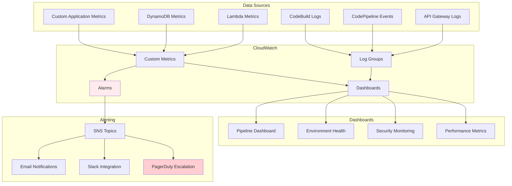
```mermaid
flowchart TB
    subgraph "Data Sources"
        DS1[API Gateway Logs]
        DS2[Lambda Metrics]
        DS3[DynamoDB Metrics]
        DS4[Custom Application Metrics]
        DS5[CodePipeline Events]
        DS6[CodeBuild Logs]
    end
    
    subgraph "CloudWatch"
        CW1[Log Groups]
        CW2[Custom Metrics]
        CW3[Alarms]
        CW4[Dashboards]
    end
    
    subgraph "Dashboards"
        D1[Pipeline Dashboard]
        D2[Environment Health]
        D3[Security Monitoring]
        D4[Performance Metrics]
    end
    
    subgraph "Alerting"
        A1[SNS Topics]
        A2[Email Notifications]
        A3[Slack Integration]
        A4[PagerDuty Escalation]
    end
    
    DS1 --> CW1
    DS2 --> CW2
    DS3 --> CW2
    DS4 --> CW2
    DS5 --> CW1
    DS6 --> CW1
    
    CW1 --> CW4
    CW2 --> CW3
    CW2 --> CW4
    CW3 --> A1
    
    CW4 --> D1
    CW4 --> D2
    CW4 --> D3
    CW4 --> D4
    
    A1 --> A2
    A1 --> A3
    A1 --> A4
    
    style CW3 fill:#ffebee
    style A4 fill:#ffcdd2
```

### Pipeline Metrics Flow

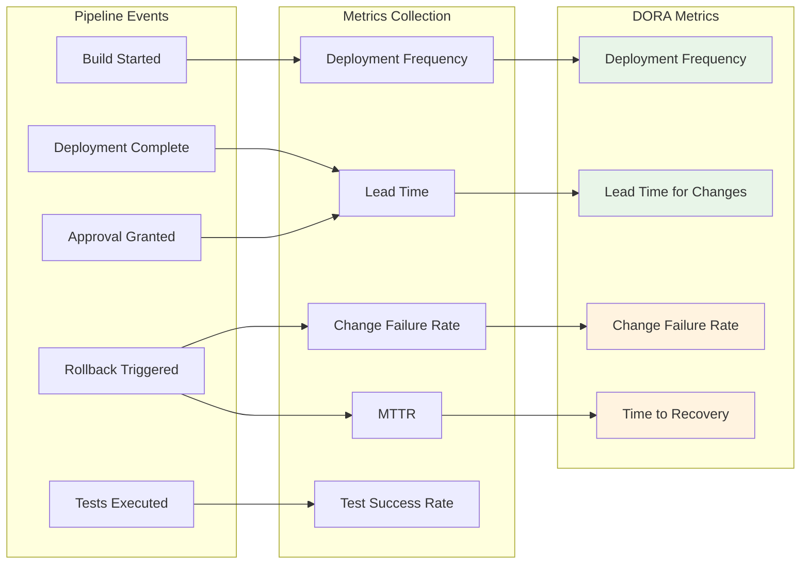
```mermaid
flowchart LR
    subgraph "Pipeline Events"
        E1[Build Started]
        E2[Tests Executed]
        E3[Deployment Complete]
        E4[Approval Granted]
        E5[Rollback Triggered]
    end
    
    subgraph "Metrics Collection"
        M1[Deployment Frequency]
        M2[Lead Time]
        M3[Change Failure Rate]
        M4[MTTR]
        M5[Test Success Rate]
    end
    
    subgraph "DORA Metrics"
        DORA1[Deployment Frequency]
        DORA2[Lead Time for Changes]
        DORA3[Change Failure Rate]
        DORA4[Time to Recovery]
    end
    
    E1 --> M1
    E2 --> M5
    E3 --> M2
    E4 --> M2
    E5 --> M3
    E5 --> M4
    
    M1 --> DORA1
    M2 --> DORA2
    M3 --> DORA3
    M4 --> DORA4
    
    style DORA1 fill:#e8f5e8
    style DORA2 fill:#e8f5e8
    style DORA3 fill:#fff3e0
    style DORA4 fill:#fff3e0
```

### CloudWatch Dashboards

```yaml
Deployment Pipeline Dashboard:
  Widgets:
    - Pipeline execution status
    - Build success/failure rates  
    - Test execution times
    - Deployment frequency
    - Lead time for changes
    - Mean time to recovery (MTTR)
    - Change failure rate
    
Environment Health Dashboard:
  Widgets:
    - API Gateway metrics per environment
    - Lambda function performance
    - Error rates and response times
    - Database connection health
    - Security event monitoring
```

### Deployment Metrics

```yaml
Custom Metrics:
  Pipeline Metrics:
    - DeploymentFrequency: Deployments per week
    - LeadTime: Commit to production time
    - ChangeFailureRate: Failed deployments percentage
    - MTTR: Time to recover from failures
    
  Quality Metrics:
    - TestCoverage: Unit test coverage percentage
    - SecurityVulnerabilities: Critical/High severity count
    - PerformanceRegression: Response time degradation
    - TechnicalDebt: Code quality metrics
```

## Security Considerations

### Pipeline Security

```yaml
IAM Roles and Policies:
  CodeBuildServiceRole:
    Permissions:
      - CloudWatch Logs access
      - S3 artifacts bucket access
      - SAM CLI operations
      - Parameter Store read access
      
  CodeDeployServiceRole:
    Permissions:
      - Lambda function deployment
      - API Gateway stage management
      - CloudFormation stack operations
      - CloudWatch alarms access
      
  CodePipelineServiceRole:
    Permissions:
      - CodeBuild project execution
      - CodeDeploy application management
      - S3 artifacts management
      - SNS notifications

Security Scanning:
  SAST (Static Application Security Testing):
    - Tool: bandit for Python security issues
    - Integration: CodeBuild pre_build phase
    - Failure Action: Stop pipeline on high/critical issues
    
  Dependency Scanning:
    - Tool: safety for known vulnerabilities
    - Integration: CodeBuild pre_build phase
    - Action: Report and continue (with notifications)
    
  Infrastructure Scanning:
    - Tool: AWS Config for infrastructure compliance
    - Integration: Post-deployment validation
    - Action: Alert on non-compliant resources
```

## Cost Optimization

### Pipeline Cost Management

```yaml
Cost Optimization Strategies:
  CodeBuild:
    - Use ARM-based instances where possible
    - Optimize build times with caching
    - Use smaller instance types for unit tests
    - Parallel test execution
    
  CodeDeploy:
    - Minimize canary deployment duration
    - Efficient traffic shifting strategy
    - Automated rollback to reduce manual intervention
    
  Storage:
    - Lifecycle policies for build artifacts
    - Compress test results and logs
    - Regular cleanup of old deployments
    
  Environments:
    - Smaller resource allocation for dev/staging
    - Scheduled shutdown for non-prod environments
    - On-demand scaling for load testing
```

## Disaster Recovery

### Pipeline Resilience

```yaml
Backup and Recovery:
  Source Code:
    - Primary: GitHub repository
    - Mirror: CodeCommit for AWS integration
    - Backup: Automated GitHub backup to S3
    
  Build Artifacts:
    - Retention: 30 days for production artifacts
    - Cross-region replication for critical releases
    - Versioned storage with metadata
    
  Configuration:
    - Parameter Store backup
    - CloudFormation template versioning
    - Infrastructure as Code in Git
    
  Database:
    - DynamoDB point-in-time recovery
    - Cross-region backups for production
    - Automated backup verification
```

## Implementation Timeline

### Implementation Roadmap

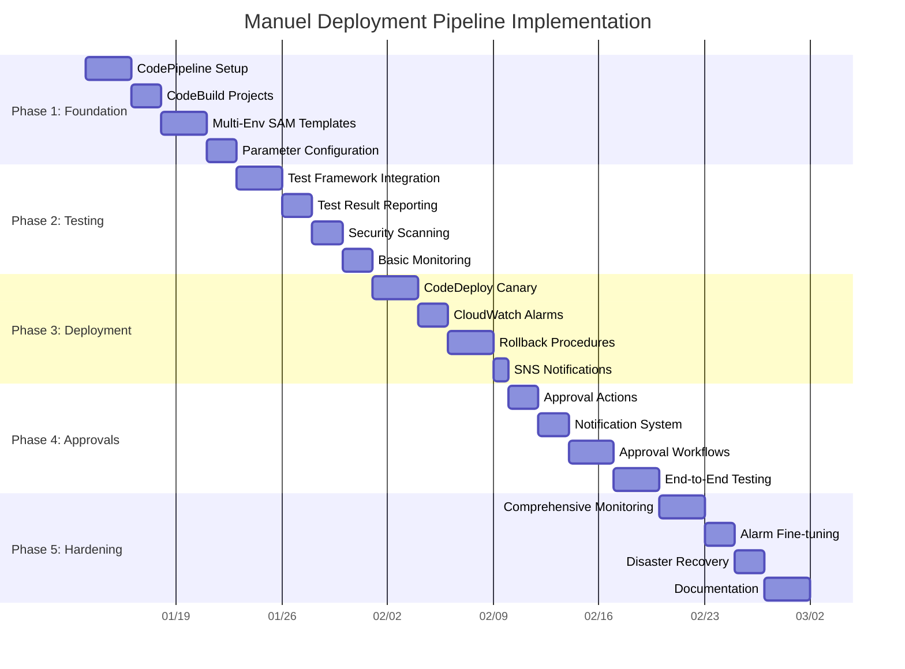
```mermaid
gantt
    title Manuel Deployment Pipeline Implementation
    dateFormat YYYY-MM-DD
    axisFormat %m/%d
    
    section Phase 1: Foundation
    CodePipeline Setup     :p1-1, 2025-01-13, 3d
    CodeBuild Projects     :p1-2, after p1-1, 2d
    Multi-Env SAM Templates:p1-3, after p1-2, 3d
    Parameter Configuration:p1-4, after p1-3, 2d
    
    section Phase 2: Testing
    Test Framework Integration:p2-1, after p1-4, 3d
    Test Result Reporting :p2-2, after p2-1, 2d
    Security Scanning     :p2-3, after p2-2, 2d
    Basic Monitoring      :p2-4, after p2-3, 2d
    
    section Phase 3: Deployment
    CodeDeploy Canary     :p3-1, after p2-4, 3d
    CloudWatch Alarms     :p3-2, after p3-1, 2d
    Rollback Procedures   :p3-3, after p3-2, 3d
    SNS Notifications    :p3-4, after p3-3, 1d
    
    section Phase 4: Approvals
    Approval Actions      :p4-1, after p3-4, 2d
    Notification System   :p4-2, after p4-1, 2d
    Approval Workflows    :p4-3, after p4-2, 3d
    End-to-End Testing    :p4-4, after p4-3, 3d
    
    section Phase 5: Hardening
    Comprehensive Monitoring:p5-1, after p4-4, 3d
    Alarm Fine-tuning     :p5-2, after p5-1, 2d
    Disaster Recovery     :p5-3, after p5-2, 2d
    Documentation         :p5-4, after p5-3, 3d
```

### Implementation Dependencies


```mermaid
flowchart TD
    subgraph "Phase 1: Foundation (Week 1-2)"
        F1[Set up CodePipeline with basic stages]
        F2[Configure CodeBuild projects]
        F3[Implement multi-environment SAM templates]
        F4[Set up parameter files and configuration]
    end
    
    subgraph "Phase 2: Testing Integration (Week 3)"
        T1[Integrate existing test framework with CodeBuild]
        T2[Set up test result reporting]
        T3[Configure security scanning]
        T4[Implement basic monitoring]
    end
    
    subgraph "Phase 3: Deployment Automation (Week 4)"
        D1[Configure CodeDeploy for canary deployments]
        D2[Set up CloudWatch alarms and monitoring]
        D3[Implement rollback procedures]
        D4[Configure SNS notifications]
    end
    
    subgraph "Phase 4: Manual Approval Gates (Week 5)"
        A1[Set up approval actions in CodePipeline]
        A2[Configure notification system]
        A3[Create approval workflows and documentation]
        A4[Test end-to-end pipeline]
    end
    
    subgraph "Phase 5: Production Hardening (Week 6)"
        H1[Implement comprehensive monitoring]
        H2[Fine-tune alarm thresholds]
        H3[Conduct disaster recovery testing]
        H4[Documentation and training]
    end
    
    F1 --> F2 --> F3 --> F4
    F4 --> T1 --> T2 --> T3 --> T4
    T4 --> D1 --> D2 --> D3 --> D4
    D4 --> A1 --> A2 --> A3 --> A4
    A4 --> H1 --> H2 --> H3 --> H4
    
    style F1 fill:#e8f5e8
    style T1 fill:#fff3e0
    style D1 fill:#e3f2fd
    style A1 fill:#fce4ec
    style H1 fill:#f3e5f5
```

### Phase Details

#### Phase 1: Foundation (Week 1-2)
- [ ] Set up CodePipeline with basic stages
- [ ] Configure CodeBuild projects
- [ ] Implement multi-environment SAM templates
- [ ] Set up parameter files and configuration

#### Phase 2: Testing Integration (Week 3)
- [ ] Integrate existing test framework with CodeBuild
- [ ] Set up test result reporting
- [ ] Configure security scanning
- [ ] Implement basic monitoring

#### Phase 3: Deployment Automation (Week 4)
- [ ] Configure CodeDeploy for canary deployments
- [ ] Set up CloudWatch alarms and monitoring
- [ ] Implement rollback procedures
- [ ] Configure SNS notifications

#### Phase 4: Manual Approval Gates (Week 5)
- [ ] Set up approval actions in CodePipeline
- [ ] Configure notification system
- [ ] Create approval workflows and documentation
- [ ] Test end-to-end pipeline

#### Phase 5: Production Hardening (Week 6)
- [ ] Implement comprehensive monitoring
- [ ] Fine-tune alarm thresholds
- [ ] Conduct disaster recovery testing
- [ ] Documentation and training

## Success Criteria

### DORA Metrics Dashboard

```mermaid
flowchart TB
    subgraph "DORA Metrics"
        D1[Deployment Frequency]
        D2[Lead Time for Changes]
        D3[Change Failure Rate]
        D4[Time to Recovery]
    end
    
    subgraph "Current State"
        C1[Manual Deployments]
        C2[3-4 hours lead time]
        C3[15% failure rate]
        C4[2-3 hours recovery]
    end
    
    subgraph "Target State"
        T1[≥1 deployment/week]
        T2[<2 hours lead time]
        T3[<5% failure rate]
        T4[<30 minutes recovery]
    end
    
    subgraph "Pipeline Benefits"
        B1[Automated Testing]
        B2[Canary Deployments]
        B3[Automatic Rollbacks]
        B4[Monitoring & Alerts]
    end
    
    C1 --> D1 --> T1
    C2 --> D2 --> T2
    C3 --> D3 --> T3
    C4 --> D4 --> T4
    
    B1 --> T3
    B2 --> T3
    B3 --> T4
    B4 --> T4
    
    style T1 fill:#e8f5e8
    style T2 fill:#e8f5e8
    style T3 fill:#e8f5e8
    style T4 fill:#e8f5e8
    style C3 fill:#ffebee
    style C4 fill:#ffebee
```

### Quality Gates Matrix

```mermaid
flowchart LR
    subgraph "Development Gates"
        DG1[Unit Tests >80%]
        DG2[Security Scan Clean]
        DG3[Code Coverage Met]
    end
    
    subgraph "Staging Gates"
        SG1[Integration Tests Pass]
        SG2[Performance Baseline]
        SG3[Security Validation]
        SG4[Chaos Tests Pass]
    end
    
    subgraph "Production Gates"
        PG1[Manual Approval]
        PG2[Canary Health Check]
        PG3[Business Metrics OK]
        PG4[Zero Critical Issues]
    end
    
    DG1 --> SG1
    DG2 --> SG3
    DG3 --> SG1
    
    SG1 --> PG1
    SG2 --> PG2
    SG3 --> PG1
    SG4 --> PG1
    
    PG1 --> PG2 --> PG3 --> PG4
    
    style PG4 fill:#e8f5e8
```

### Key Performance Indicators

```yaml
Deployment Metrics:
  Frequency:
    - Target: At least 1 deployment per week
    - Measurement: Pipeline execution count
    
  Lead Time:
    - Target: < 2 hours from commit to production
    - Measurement: Commit timestamp to deployment complete
    
  Success Rate:
    - Target: > 95% successful deployments
    - Measurement: Successful deployments / Total deployments
    
  MTTR (Mean Time To Recovery):
    - Target: < 30 minutes for rollbacks
    - Measurement: Issue detection to service restoration
    
Quality Metrics:
  Test Coverage:
    - Target: > 80% unit test coverage
    - Target: > 90% integration test coverage
    
  Security:
    - Target: 0 critical security vulnerabilities
    - Target: < 5 high severity vulnerabilities
    
  Performance:
    - Target: No performance regression > 10%
    - Target: All canary deployments meet SLA requirements
```

## Conclusion

This deployment pipeline specification provides a comprehensive, AWS-native approach to managing the Manuel backend deployments across multiple environments. The pipeline emphasizes:

1. **Safety**: Multiple testing stages and manual approval gates
2. **Reliability**: Automated rollback and comprehensive monitoring
3. **Efficiency**: Automated deployments with minimal manual intervention
4. **Visibility**: Comprehensive monitoring and notification system
5. **Scalability**: Support for API versioning and canary deployments

The implementation will transform the current manual deployment process into a robust, enterprise-grade CI/CD pipeline that supports rapid, safe delivery of new features while maintaining high availability and performance standards.

---

**Next Steps**: Upon approval of this specification, we will proceed with the implementation phase, starting with the foundation components and building up to the complete automated pipeline.