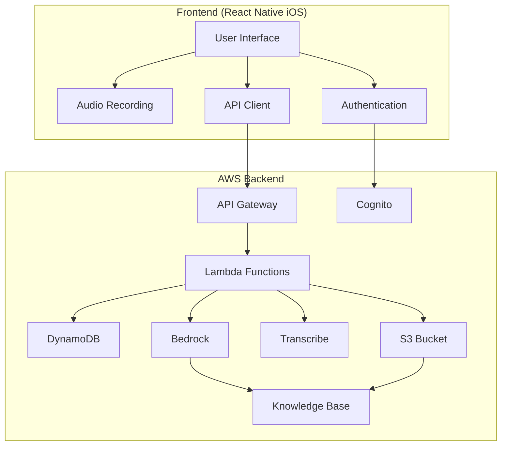
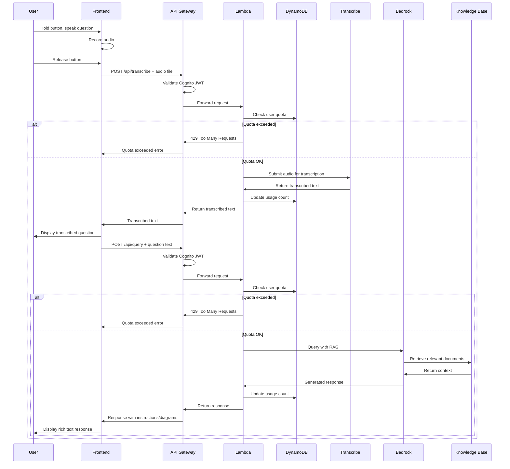
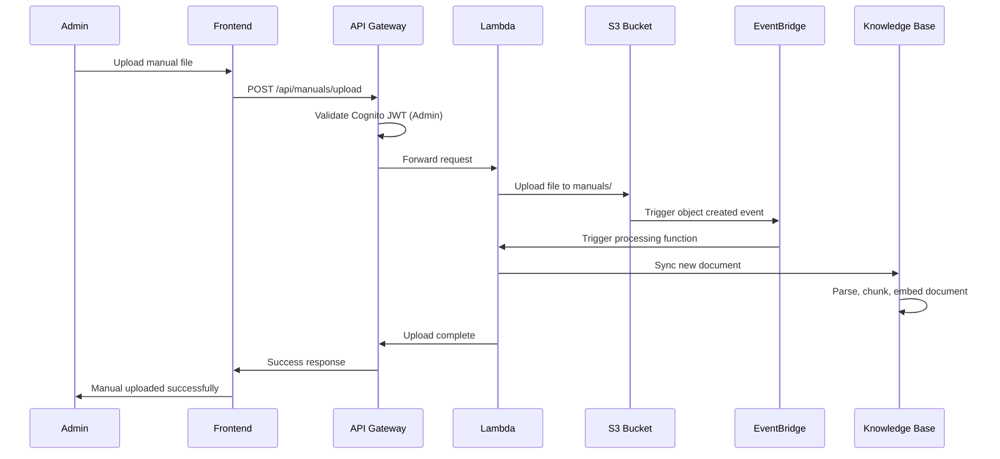
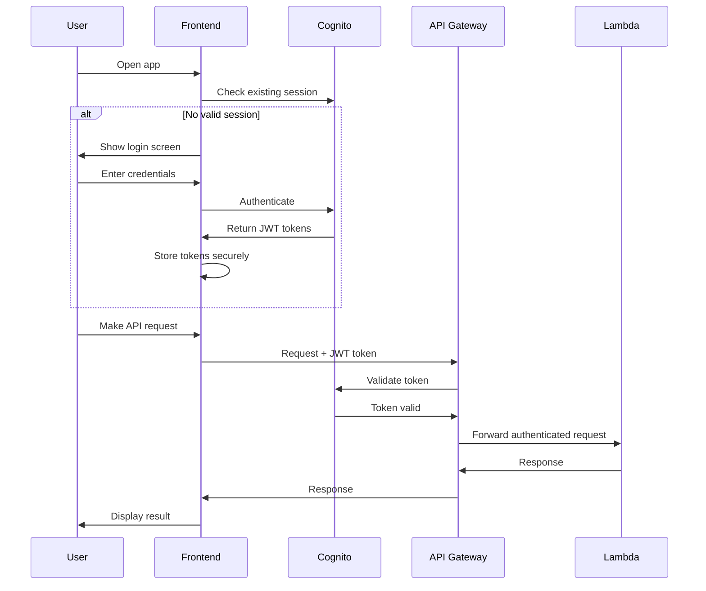
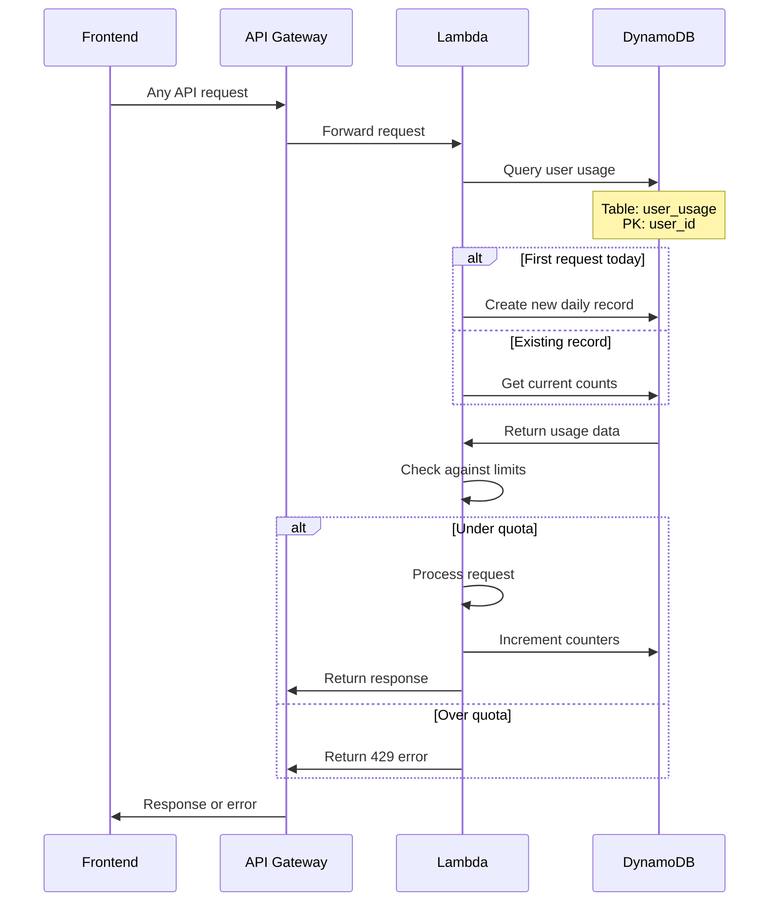
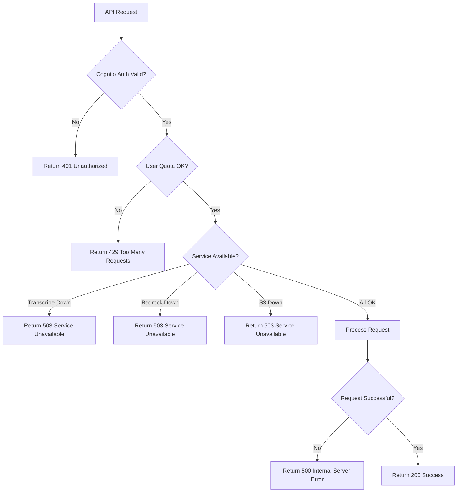

# Manuel - Project Plan

## Project Overview
Manuel is an intelligent assistant app that allows users to ask questions about product manuals via voice input. The app uses RAG (Retrieval Augmented Generation) to provide detailed, contextual answers from a knowledge base of product manuals.

## Core User Flow
1. User holds button on iPhone to record audio question
2. Audio is transcribed to text
3. Question is processed by LLM with RAG augmentation
4. LLM retrieves relevant manual information and generates response
5. Response (text, instructions, diagrams) is displayed to user

## Features & Requirements
- **Voice Input**: Hold-to-record button interface
- **Audio Transcription**: Speech-to-text conversion
- **RAG-Powered Q&A**: Context-aware responses from product manuals
- **Rich Text Responses**: Support for detailed instructions, steps, mermaid diagrams
- **Manual Management**: Auto-update system for new/updated manuals
- **AWS-Native**: Leverage AWS services throughout

## Technical Architecture
### Frontend (React Native iOS)
- Audio recording and playback
- Real-time transcription display
- Rich text rendering (including mermaid diagrams)
- API integration with Cognito authentication
- User login/signup flows

### Backend (AWS Services)
- **Audio Processing**: AWS Transcribe for speech-to-text
- **LLM & RAG**: AWS Bedrock for language model and RAG capabilities
- **Document Storage**: S3 for manual storage and versioning
- **Document Processing**: Bedrock Knowledge Base automatic parsing
- **Vector Search**: Bedrock Knowledge Base (AWS-native RAG)
- **API Layer**: API Gateway + Lambda + Cognito authentication
- **Event Processing**: S3 events + EventBridge for auto-updates
- **Usage Tracking**: DynamoDB for user quotas and rate limiting

## API Endpoints
- `POST /api/transcribe` - Audio transcription
- `POST /api/query` - Submit question and get RAG response
- `GET /api/manuals` - List available manuals
- `POST /api/manuals/upload` - Upload new manual (triggers processing)
- `GET /api/user/usage` - Get current user usage stats
- `GET /api/user/quota` - Get user quota limits

## AWS Services Architecture
- **S3**: Manual storage, audio file temporary storage
- **Transcribe**: Audio-to-text conversion
- **Bedrock**: LLM inference and RAG
- **Lambda**: Serverless processing functions
- **API Gateway**: REST API management with Cognito authorizer
- **Cognito**: User authentication and authorization
- **DynamoDB**: User quotas and usage tracking
- **EventBridge**: Event-driven manual updates
- **Bedrock Knowledge Base**: Document embeddings and RAG retrieval

## Manual Update Pipeline
1. New manual uploaded to S3
2. S3 event triggers Lambda function
3. Lambda triggers Bedrock Knowledge Base sync
4. Bedrock automatically parses, chunks, and embeds document
5. RAG system automatically uses updated knowledge base

## Implementation Timeline

### Phase 1: Core Infrastructure (Week 1-2)
**AWS Setup & Authentication**
- [ ] Set up AWS account and configure IAM roles
- [ ] Create Cognito User Pool with basic configuration
- [ ] Set up API Gateway with Cognito authorizer
- [ ] Create basic Lambda function structure
- [ ] Set up DynamoDB tables for user usage tracking
- [ ] Configure S3 bucket for manual storage
- [ ] Basic deployment pipeline (SAM/CDK)

**Expected Deliverables:**
- Working authentication flow
- Basic API Gateway endpoints returning mock data
- User registration/login functional

### Phase 2: Audio Processing (Week 3)
**Transcription Pipeline**
- [ ] Implement audio upload to S3 (temporary storage)
- [ ] Create Lambda function for AWS Transcribe integration
- [ ] Build `POST /api/transcribe` endpoint
- [ ] Add quota checking middleware
- [ ] Error handling for audio processing failures
- [ ] Audio file cleanup after processing

**Expected Deliverables:**
- Working speech-to-text conversion
- Quota enforcement active
- Audio processing errors handled gracefully

### Phase 3: RAG System (Week 4-5)
**Knowledge Base Setup**
- [ ] Create Bedrock Knowledge Base
- [ ] Configure embedding model (Amazon Titan)
- [ ] Set up document ingestion pipeline
- [ ] Upload initial test manuals
- [ ] Create Lambda function for Bedrock queries
- [ ] Build `POST /api/query` endpoint
- [ ] Implement RAG retrieval and generation

**Expected Deliverables:**
- Working RAG system with test manuals
- Question answering functional
- Rich text responses with formatting

### Phase 4: Manual Management (Week 6)
**Document Pipeline**
- [ ] Build `POST /api/manuals/upload` endpoint
- [ ] Create S3 event triggers for new uploads
- [ ] Implement Knowledge Base sync Lambda
- [ ] Add manual versioning support
- [ ] Create `GET /api/manuals` endpoint
- [ ] Build admin interface for manual management

**Expected Deliverables:**
- Automated document ingestion
- Manual versioning system
- Admin can upload/manage manuals

### Phase 5: Frontend Development (Week 7-9)
**React Native iOS App**
- [ ] Set up React Native project with Expo
- [ ] Implement AWS Amplify for authentication
- [ ] Build login/signup screens
- [ ] Create voice recording interface
- [ ] Implement hold-to-record functionality
- [ ] Build API client with error handling
- [ ] Create rich text display component
- [ ] Add mermaid diagram rendering
- [ ] Implement usage quota display

**Expected Deliverables:**
- Complete iOS app with all features
- Voice recording and playback
- Rich text response display
- User account management

### Phase 6: Integration & Testing (Week 10)
**End-to-End Testing**
- [ ] Integration testing of complete user flow
- [ ] Performance testing with various audio lengths
- [ ] Load testing for concurrent users
- [ ] Error scenario testing
- [ ] Security testing (auth, quotas, data validation)
- [ ] User acceptance testing
- [ ] Bug fixes and optimizations

**Expected Deliverables:**
- Fully tested application
- Performance benchmarks
- Security validation complete

### Phase 7: Production Deployment (Week 11)
**Production Setup**
- [ ] Set up production AWS environment
- [ ] Configure CloudWatch monitoring and alerts
- [ ] Set up backup and disaster recovery
- [ ] Create deployment automation
- [ ] Configure SSL certificates
- [ ] Set up custom domain (if needed)
- [ ] Production data migration
- [ ] Go-live checklist completion

**Expected Deliverables:**
- Production-ready application
- Monitoring and alerting active
- Backup systems in place

### Phase 8: Documentation & Handover (Week 12)
**Project Completion**
- [ ] Create user documentation
- [ ] Write technical documentation
- [ ] Create deployment runbooks
- [ ] Set up maintenance procedures
- [ ] Create troubleshooting guides
- [ ] Conduct knowledge transfer sessions
- [ ] Project retrospective

**Expected Deliverables:**
- Complete documentation package
- Maintenance procedures defined
- Project officially handed over

## Risk Mitigation
- **Bedrock Quota Limits**: Request quota increases early
- **iOS App Store**: Not needed for internal app, using TestFlight
- **Cost Management**: Implement spend alerts and usage monitoring
- **Audio Quality**: Test with various microphone qualities
- **Manual Format Issues**: Have fallback for problematic documents

## Dependencies
- AWS account with appropriate service limits
- iOS developer account (for TestFlight)
- Test product manuals for Knowledge Base
- Target users for UAT testing

## Success Metrics
- Audio transcription accuracy > 95%
- Query response time < 5 seconds
- User satisfaction score > 4.5/5
- System uptime > 99.5%
- Cost per query within budget targets

## Architecture Decisions Needed
1. ✅ **Vector Storage**: Bedrock Knowledge Base (AWS-native)
2. ✅ **Document Processing**: Bedrock automatic parsing (PDF primary)
3. ✅ **Authentication**: AWS Cognito for user management
4. ✅ **Rate Limiting**: User-based quotas via DynamoDB tracking
5. ✅ **Manual Format Support**: PDF primary, with support for TXT, MD, HTML, DOC/DOCX

## User Quota System
- **Daily Limits**: 50 queries per user per day
- **Monthly Limits**: 1000 queries per user per month
- **Tracking**: DynamoDB table with user_id, date, query_count
- **Enforcement**: Lambda middleware checks quota before processing
- **Admin Override**: Configurable limits per user tier

## System Flow Diagrams

### Overall System Architecture

### Voice Query Flow

### Manual Upload Flow

### Authentication Flow

### Quota Management Flow

### Error Handling Flow

## Notes
- Focus on AWS-native solutions where possible
- Consider costs for Bedrock usage
- Plan for scalability as manual library grows
- Consider offline capabilities for critical information