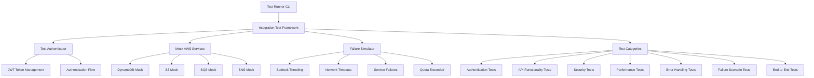
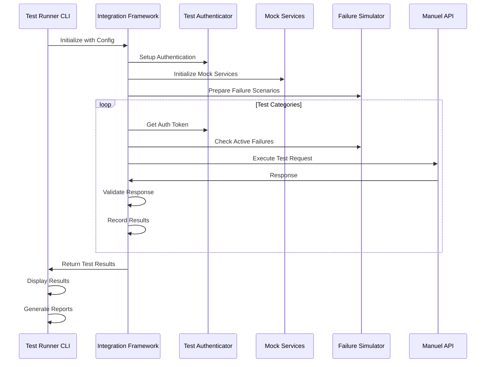
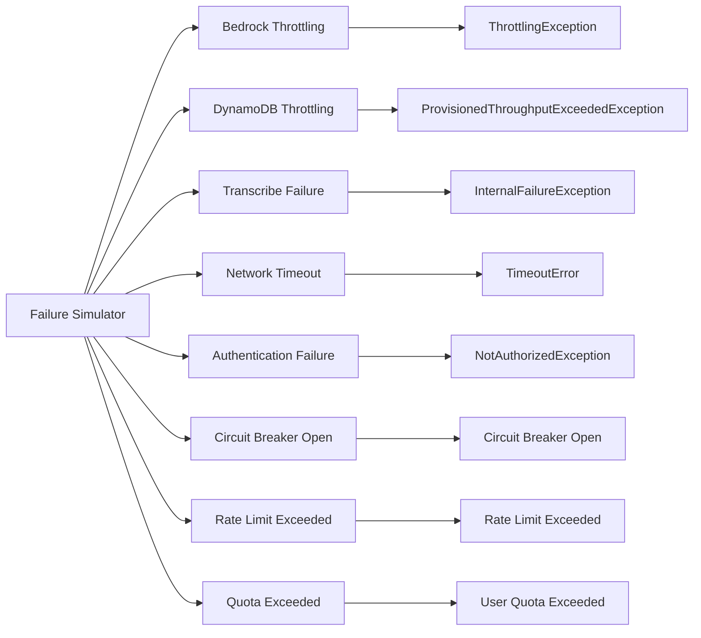

# Manuel Backend Integration Tests

## Overview

This directory contains comprehensive integration tests for the Manuel backend, featuring enterprise-grade testing capabilities with failure scenario simulation, performance testing, and security validation.

## Architecture

### Test Framework Components



### Test Execution Flow



## Features

### Test Categories

1. **Authentication Tests**
   - User authentication flow
   - Token refresh mechanism
   - Invalid/expired token handling
   - Session management

2. **API Functionality Tests**
   - Transcribe endpoint testing
   - Query endpoint validation
   - Usage statistics retrieval
   - Manual management operations
   - Health and version checks

3. **Security Tests**
   - SQL injection protection
   - XSS prevention
   - Rate limiting enforcement
   - Request size validation
   - CORS policy verification
   - Security headers validation

4. **Performance Tests**
   - Response time measurement
   - Concurrent request handling
   - Cache performance validation
   - Connection pooling efficiency

5. **Error Handling Tests**
   - Error response format validation
   - Retry mechanism testing
   - Circuit breaker functionality
   - Dead letter queue processing
   - Error notification system

6. **Failure Scenario Tests (Chaos Engineering)**
   - Bedrock API throttling
   - DynamoDB throttling
   - Transcribe service failures
   - Network timeout scenarios
   - Quota exceeded situations

7. **End-to-End Tests**
   - Complete voice query flow
   - Manual upload and query
   - Quota enforcement flow
   - Error recovery scenarios

### Failure Simulation

The framework includes a sophisticated failure simulator that can inject various types of failures:



## Quick Start

### Installation

```bash
# Install dependencies
pip install -r fixtures/requirements.txt

# Or use the Makefile
make install
```

### Basic Usage

```bash
# Run all tests with default configuration
python test_runner.py

# Run tests with custom configuration
python test_runner.py --config test_config.json

# Run environment-specific tests
python test_runner.py --environment staging --config test_config.json
```

### Using Make Commands

```bash
# Run all tests
make test

# Run specific test categories
make test-smoke
make test-auth
make test-api
make test-security
make test-performance
make test-e2e

# Run chaos engineering tests
make test-chaos

# Run environment-specific tests
make test-dev
make test-staging
make test-prod
```

### Using Pytest

```bash
# Run all pytest tests
pytest pytest_tests.py -v

# Run specific test categories
pytest -m auth -v
pytest -m security -v
pytest -m performance -v

# Run with coverage
pytest --cov=test_framework --cov-report=html -v
```

## Configuration

### Test Configuration File

Create `test_config.json`:

```json
{
  "api_base_url": "https://api.manuel.yourdomain.com",
  "test_user_email": "test@manuel.yourdomain.com",
  "test_user_password": "TestUser123!",
  "timeout_seconds": 30,
  "max_retries": 3,
  "parallel_tests": 4,
  "enable_chaos_testing": true,
  "enable_load_testing": true,
  "enable_security_testing": true
}
```

### Environment-Specific Configuration

The configuration file supports environment-specific settings:

```json
{
  "test_environments": {
    "dev": {
      "api_base_url": "http://localhost:3000",
      "enable_chaos_testing": false,
      "enable_load_testing": false,
      "enable_security_testing": false
    },
    "staging": {
      "api_base_url": "https://staging-api.manuel.yourdomain.com",
      "enable_chaos_testing": true,
      "enable_load_testing": true,
      "enable_security_testing": true
    },
    "prod": {
      "api_base_url": "https://api.manuel.yourdomain.com",
      "enable_chaos_testing": false,
      "enable_load_testing": false,
      "enable_security_testing": true
    }
  }
}
```

## Command Line Options

### Test Runner Options

```bash
# Configuration
--config, -c          Path to test configuration file
--environment, -e     Test environment (dev/staging/prod)

# Test execution
--api-url            API base URL override
--timeout            Request timeout in seconds
--parallel           Number of parallel tests

# Test types
--chaos              Enable chaos testing
--load               Enable load testing
--security           Enable security testing

# Output
--output, -o         Save results to JSON file
--verbose, -v        Show detailed output
--framework          Use framework class directly
```

### Pytest Options

```bash
# Run specific markers
pytest -m auth              # Authentication tests
pytest -m api               # API functionality tests
pytest -m security          # Security tests
pytest -m performance       # Performance tests
pytest -m e2e               # End-to-end tests
pytest -m chaos             # Chaos engineering tests
pytest -m load              # Load tests
pytest -m smoke             # Smoke tests

# Exclude slow tests
pytest -m "not slow"

# Run with coverage
pytest --cov=test_framework --cov-report=html

# Generate HTML report
pytest --html=report.html --self-contained-html
```

## Test Results

### Result Structure

```json
{
  "summary": {
    "total_tests": 45,
    "passed": 42,
    "failed": 3,
    "skipped": 0,
    "success_rate": 93.3,
    "total_duration_ms": 125000,
    "average_test_duration_ms": 2777
  },
  "test_results": [
    {
      "test_name": "test_user_authentication",
      "status": "passed",
      "duration_ms": 1234,
      "error_message": null,
      "details": null,
      "metrics": null
    }
  ],
  "failed_tests": [
    {
      "test_name": "test_bedrock_throttling_scenario",
      "status": "failed",
      "duration_ms": 5000,
      "error_message": "Bedrock throttling not handled correctly",
      "details": {...},
      "metrics": {...}
    }
  ],
  "performance_metrics": {
    "min_duration_ms": 100,
    "max_duration_ms": 5000,
    "avg_duration_ms": 2777,
    "p50_duration_ms": 2000,
    "p95_duration_ms": 4500,
    "p99_duration_ms": 4900
  }
}
```

### Performance Metrics

The framework automatically collects performance metrics:

- **Response Times**: Min, max, average, percentiles
- **Success Rates**: Per test category and overall
- **Error Rates**: By error type and severity
- **Cache Performance**: Hit rates and response time improvements
- **Concurrent Performance**: Throughput and latency under load

## Integration with CI/CD

### GitHub Actions

```yaml
name: Integration Tests
on: [push, pull_request]

jobs:
  integration-tests:
    runs-on: ubuntu-latest
    steps:
      - uses: actions/checkout@v3
      - name: Set up Python
        uses: actions/setup-python@v4
        with:
          python-version: '3.11'
      
      - name: Install dependencies
        run: |
          cd backend/tests/integration
          pip install -r fixtures/requirements.txt
      
      - name: Run smoke tests
        run: |
          cd backend/tests/integration
          make test-smoke
      
      - name: Run integration tests
        run: |
          cd backend/tests/integration
          make test-dev
      
      - name: Generate coverage report
        run: |
          cd backend/tests/integration
          make coverage
      
      - name: Upload test results
        uses: actions/upload-artifact@v3
        if: always()
        with:
          name: test-results
          path: backend/tests/integration/results/
```

### Jenkins Pipeline

```groovy
pipeline {
    agent any
    
    stages {
        stage('Setup') {
            steps {
                dir('backend/tests/integration') {
                    sh 'make install'
                }
            }
        }
        
        stage('Smoke Tests') {
            steps {
                dir('backend/tests/integration') {
                    sh 'make test-smoke'
                }
            }
        }
        
        stage('Integration Tests') {
            parallel {
                stage('Auth Tests') {
                    steps {
                        dir('backend/tests/integration') {
                            sh 'make test-auth'
                        }
                    }
                }
                stage('API Tests') {
                    steps {
                        dir('backend/tests/integration') {
                            sh 'make test-api'
                        }
                    }
                }
                stage('Security Tests') {
                    steps {
                        dir('backend/tests/integration') {
                            sh 'make test-security'
                        }
                    }
                }
            }
        }
        
        stage('Performance Tests') {
            steps {
                dir('backend/tests/integration') {
                    sh 'make test-performance'
                }
            }
        }
        
        stage('Generate Reports') {
            steps {
                dir('backend/tests/integration') {
                    sh 'make report'
                    sh 'make coverage'
                }
            }
        }
    }
    
    post {
        always {
            publishHTML([
                allowMissing: false,
                alwaysLinkToLastBuild: true,
                keepAll: true,
                reportDir: 'backend/tests/integration/results',
                reportFiles: 'report.html',
                reportName: 'Integration Test Report'
            ])
        }
    }
}
```

## Advanced Features

### Chaos Engineering

The framework includes advanced chaos engineering capabilities:

```python
# Activate failure scenarios
framework.failure_simulator.activate_failure('bedrock_throttling', 30)
framework.failure_simulator.activate_failure('network_timeout', 15)

# Test system resilience
results = framework.run_failure_scenario_tests()
```

### Load Testing Integration

```python
# Configure load testing
config = TestConfig(
    enable_load_testing=True,
    parallel_tests=10,
    max_concurrent_requests=50
)

# Run load tests
framework = IntegrationTestFramework(config)
results = framework.run_performance_tests()
```

### Custom Test Extensions

```python
# Extend the framework
class CustomTestFramework(IntegrationTestFramework):
    def _test_custom_functionality(self):
        # Custom test implementation
        pass
    
    def _run_custom_tests(self):
        tests = [
            ('test_custom_functionality', self._test_custom_functionality)
        ]
        
        for test_name, test_func in tests:
            self._run_single_test(test_name, test_func)
```

## Troubleshooting

### Common Issues

1. **Authentication Failures**
   - Check test user credentials
   - Verify API base URL
   - Confirm Cognito configuration

2. **API Connectivity Issues**
   - Verify network connectivity
   - Check API Gateway configuration
   - Confirm CORS settings

3. **Test Timeouts**
   - Increase timeout values
   - Check API response times
   - Verify Lambda function performance

4. **Mock Service Issues**
   - Ensure moto library is installed
   - Check mock service initialization
   - Verify AWS SDK compatibility

### Debug Mode

```bash
# Enable debug mode
python test_runner.py --verbose --output debug_results.json

# Use pytest debug mode
pytest -v --tb=long --capture=no
```

### Performance Profiling

```bash
# Profile test execution
python -m cProfile -o profile.stats test_runner.py

# Analyze profile
python -c "import pstats; p = pstats.Stats('profile.stats'); p.sort_stats('cumulative'); p.print_stats(10)"
```

## Best Practices

### Test Organization

1. **Group Related Tests**: Use test categories and markers
2. **Independent Tests**: Ensure tests don't depend on each other
3. **Realistic Data**: Use realistic test data and scenarios
4. **Environment Isolation**: Separate test environments properly

### Performance Optimization

1. **Parallel Execution**: Use parallel test execution where possible
2. **Mock Services**: Use mocks for external dependencies
3. **Test Data Management**: Efficiently manage test data lifecycle
4. **Resource Cleanup**: Ensure proper cleanup after tests

### Monitoring and Alerting

1. **Test Metrics**: Monitor test execution metrics
2. **Failure Alerts**: Set up alerts for test failures
3. **Performance Tracking**: Track test performance over time
4. **Trend Analysis**: Analyze test trends and patterns

## Contributing

### Adding New Tests

1. Add test methods to the appropriate test class
2. Use descriptive test names and docstrings
3. Include appropriate pytest markers
4. Update configuration if needed

### Extending the Framework

1. Follow the existing code structure
2. Add comprehensive documentation
3. Include error handling and logging
4. Write tests for new functionality

### Test Data Management

1. Use fixtures for reusable test data
2. Clean up test data after execution
3. Use realistic but sanitized data
4. Avoid hardcoded values

## Support

For questions or issues:

1. Check the test results and logs
2. Review the configuration settings
3. Verify network connectivity and API access
4. Contact the development team for assistance

## License

This test framework is part of the Manuel project and follows the same license terms.